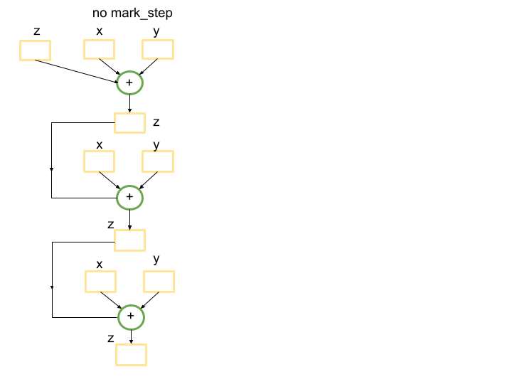
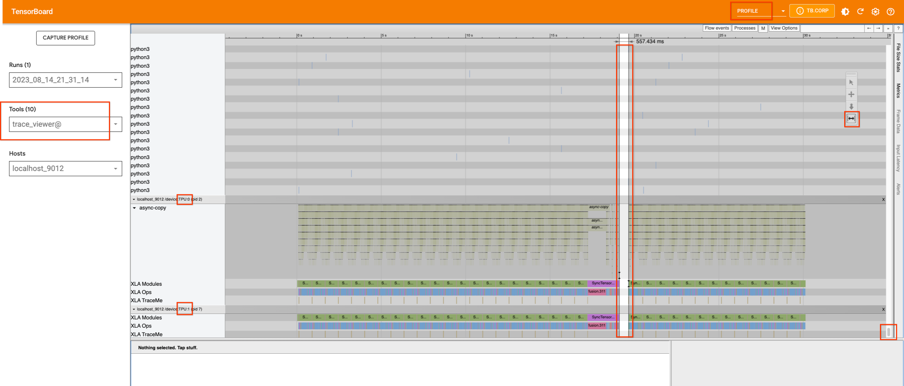
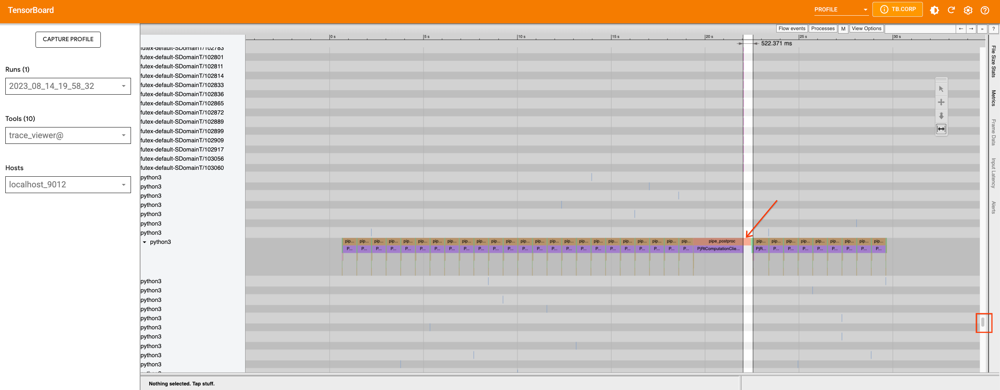
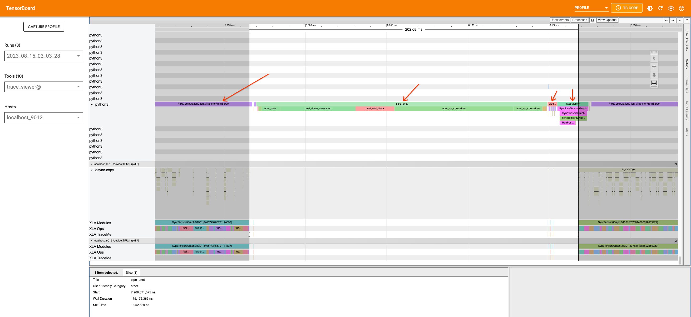

### **Objective:**
This document provides a high-level overview of PyTorch XLA and illustrates a
few examples how PyTorch code is converted to run on XLA devices (e.g. TPUs).
This is not a complete solution, and additional changes may be required
depending on the specific code. However, this document should serve as a
starting point for the conversion process.


# Basic high-level understanding of some XLA details
This section provides a brief overview of the basic details of PyTorch XLA,
 which should help readers better understand the required modifications and
 optimizations of code. It is supplement to the API guide described [here](https://github.com/pytorch/xla/blob/master/API_GUIDE.md).

Unlike regular PyTorch, which executes code line by line and does not block execution until the value of a <ins> PyTorch tensor </ins> is fetched, PyTorch XLA works differently. It iterates through the python code and records the operations on <ins> (PyTorch) XLA tensors </ins> in an intermediate representation (IR) graph until it encounters a barrier (discussed below). This process of generating the IR graph is referred to as tracing (LazyTensor tracing or code tracing). PyTorch XLA then converts the IR graph to a lower-level machine-readable format called HLO (High-Level Opcodes). HLO is a representation of a computation that is specific to the XLA compiler and allows it to generate efficient code for the hardware that it is running on. HLO is fed to the XLA compiler for compilation and optimization. Compilation is then cached by PyTorch XLA to be reused later if/when needed. The compilation of the graph is done on the host (CPU), which is the machine that runs the Python code. If there are multiple XLA devices, the host compiles the code for each of the devices separately except when using SPMD (single-program, multiple-data). For example, v4-8 has one host machine and [four devices](https://cloud.google.com/tpu/docs/system-architecture-tpu-vm#tpu_v4). In this case the host compiles the code for each of the four devices separately. In case of pod slices, when there are multiple hosts, each host does the compilation for XLA devices it is attached to. If SPMD is used, then the code is compiled only once (for given shapes and computations) on each host for all the devices.


For more details and examples, please refer to the [LazyTensor guide](https://pytorch.org/blog/understanding-lazytensor-system-performance-with-pytorch-xla-on-cloud-tpu/).

The operations in the IR graph are executed only when values of tensors are needed. This is referred to as evaluation or materialization of tensors. Sometimes this is also called lazy evaluation and it can lead to significant [performance improvements](https://arxiv.org/pdf/2102.13267.pdf).

The _synchronous_ operations in Pytorch XLA, like printing, logging, checkpointing or callbacks  block tracing and result in slower execution. In the case when an operation requires a specific value of an XLA tensor, e.g. `print(xla_tensor_z)`, tracing is blocked until the value of that tensor is available to the host. Note that only the part of the graph responsible for computing that tensor value is executed. These operations do not cut the IR graph, but they trigger host-device communication through `TransferFromServer`, which results in slower performance.

A _barrier_ is a special instruction that tells XLA to execute the IR graph and materialize the tensors. This means that the PyTorch XLA tensors will be evaluated, and the results will be available to the host. The user-exposed barrier in Pytorch XLA is [xm.mark_step()](https://github.com/pytorch/xla/blob/bdceee54eca1269ee954f6cdd1868c584d0e88a4/torch_xla/core/xla_model.py#L808), which  breaks the IR graph and results in code execution on the XLA devices. One of the key properties of `xm.mark_step` is that unlike synchronous operations it does not block the further tracing while the device is executing the graph. However, it does block access to the values of the tensors that are being materialized.

The example in the LazyTensor guide illustrates what happens in a simple case of adding two tensors. Now, suppose we have a for loop that adds XLA tensors and uses the value later:

```
for x, y in tensors_on_device:
    z += x + y
```

Without a barrier, the Python tracing will result in a single graph that wraps the addition of tensors `len(tensors_on_device)` times. This is because the `for` loop is not captured by the tracing, so each iteration of the loop will create a new  subgraph corresponding to the computation of `z += x+y` and add it to the graph. Here is an example when `len(tensors_on_device)=3`.



However, introducing a barrier at the end of the loop will result in a smaller graph that will be compiled once during the first pass inside the `for` loop and will be reused for the next  `len(tensors_on_device)-1 ` iterations. The barrier will signal to the tracing that the graph traced so far can be submitted for execution, and if that graph has been seen before, a cached compiled program will be reused.

```
for x, y in tensors_on_device:
    z += x + y
    xm.mark_step()
```

In this case there will be a small graph that is used `len(tensors_on_device)=3` times.


It is important to highlight that in PyTorch XLA Python code inside for loops is traced and a new graph is constructed for each iteration if there is a barrier at the end. This can be a significant performance bottleneck.

The XLA graphs can be reused when the same computation happens on the same shapes of tensors. If the shapes of the inputs or intermediate tensors change, then the XLA compiler will recompile a new graph with the new tensor shapes. This means that if you have dynamic shapes or if your code does not reuse tensor graphs, running your model on XLA will not be suitable for that use case. Padding the input into a fixed shape can be an option to help avoid dynamic shapes. Otherwise, a significant amount of time will be spent by the compiler on optimizing and fusing operations which will not be used again.

The trade-off between graph size and compilation time is also important to consider. If there is one large IR graph, the XLA compiler can spend a lot of time on optimization and fusion of the ops. This can result in a very long compilation time. However, the later execution may be much faster, due to the optimizations that were performed during compilation.

Sometimes it is worth breaking the IR graph with `xm.mark_step()`. As explained above, this will result in a smaller graph that can be reused later. However making graphs smaller can reduce optimizations that otherwise could be done by the XLA compiler.

Another important point to consider is [MPDeviceLoader](https://github.com/pytorch/xla/blob/a1f822e2627a5639464273241821852677401026/torch_xla/distributed/parallel_loader.py#L186). Once your code is running on an XLA device, consider wrapping the torch dataloader with XLA `MPDeviceLoader` which preloads data to the device to improve performance and includes `xm.mark_step()` in it. The latter automatically breaks the iterations over batches of data and sends them for execution. Note, if you are not using MPDeviceLoader, you might need to set `barrier=True` in the `optimizer_step()` to enable `xm.mark_step()` if running a training job or explicitly adding `xm.mark_step()`.

# TPU Setup
Create TPU with base image to use nightly wheels or from the stable release by specifying the `RUNTIME_VERSION`.
```
export ZONE=us-central2-b
export PROJECT_ID=your-project-id
export ACCELERATOR_TYPE=v4-8 # v4-16, v4-32, …
export RUNTIME_VERSION=tpu-vm-v4-pt-2.0 # or tpu-vm-v4-base
export TPU_NAME=your_tpu_name

gcloud compute tpus tpu-vm create ${TPU_NAME} \
--zone=${ZONE} \
--accelerator-type=${ACCELERATOR_TYPE} \
--version=${RUNTIME_VERSION} \
--subnetwork=tpusubnet
```

If you have a single host VM (e.g. v4-8), you can ssh to your vm and run the following commands from the vm directly. Otherwise, in case of TPU pods, you can use `--worker=all --command=""` similar to

```
gcloud compute tpus tpu-vm ssh ${TPU_NAME} \
--zone=us-central2-b \
--worker=all \
--command="pip3 install https://storage.googleapis.com/pytorch-xla-releases/wheels/tpuvm/torch-nightly-cp38-cp38-linux_x86_64.whl"
```

Next, if you are using base image, install nightly packages  and required libraries

```
pip3 install https://storage.googleapis.com/pytorch-xla-releases/wheels/tpuvm/torch-nightly-cp38-cp38-linux_x86_64.whl
​​pip3 install https://storage.googleapis.com/pytorch-xla-releases/wheels/tpuvm/torch_xla-nightly-cp38-cp38-linux_x86_64.whl
sudo apt-get install libopenblas-dev -y

sudo apt-get update && sudo apt-get install libgl1 -y # diffusion specific
```

# Converting code to PyTorch XLA
General guidelines to modify your code:
* Replace `cuda` with `xm.xla_device()`
* Remove progress bar, printing that would access the XLA tensor values
* Reduce logging and callbacks that would access the XLA tensor values
* Wrap data loader with MPDeviceLoader
* Profile to further optimize the code

Remember: each case is unique so you might need to do something different for each case.

# Example 1. Stable Diffusion inference in PyTorch Lightning on a Single TPU Device

As a first example consider the [inference code](https://github.com/pytorch-tpu/stable-diffusion/blob/main/scripts/txt2img.py) of the stable diffusion model in PyTorch Lightning which can be run from command line as
```
python scripts/txt2img.py --prompt "a photograph of an astronaut riding a horse"
```

For your reference, the diff of modifications described below can be found [here](https://github.com/pytorch-tpu/stable-diffusion/commit/57f398eb784387e244dc5fb78421aa5261abd1ef). Let's go over them step by step.
As in the general guideline above, start with changes related to `cuda` device. This inference code is written to run on GPUs and `cuda` can be found in multiple places. Start making changes by removing  `model.cuda()` from [this line](https://github.com/pytorch-tpu/stable-diffusion/blob/978da4c625a712a01ee066d019a0b0d2319cd8b3/scripts/txt2img.py#L64), and `precision_scope` from [here](https://github.com/pytorch-tpu/stable-diffusion/blob/978da4c625a712a01ee066d019a0b0d2319cd8b3/scripts/txt2img.py#L290). Additionally, replace the `cuda` device in [this line](https://github.com/pytorch-tpu/stable-diffusion/blob/978da4c625a712a01ee066d019a0b0d2319cd8b3/scripts/txt2img.py#L248) with the `xla` device similar to the code below:

Next, this particular configuration of the model is using `FrozenCLIPEmbedder`, therefore we will modify this [line](https://github.com/pytorch-tpu/stable-diffusion/blob/978da4c625a712a01ee066d019a0b0d2319cd8b3/ldm/modules/encoders/modules.py#L143) as well. For simplicity we will directly define the `device` in this tutorial, but you can pass the `device` value to the function as well.
```
import torch_xla.core.xla_model as xm
self.device = xm.xla_device()
```

Another place in the code that has cuda specific code is DDIM scheduler. Add `import torch_xla.core.xla_model as xm` on top of the file then replace [these](https://github.com/pytorch-tpu/stable-diffusion/blob/978da4c625a712a01ee066d019a0b0d2319cd8b3/ldm/models/diffusion/ddim.py#L21-L22) lines


```
if attr.device != torch.device("cuda"):
   attr = attr.to(torch.device("cuda"))
```

with

```
device = xm.xla_device()
attr = attr.to(torch.device(device))
```

Next, you can reduce device (TPU) and host (CPU) communication by removing print statements, disabling progress bars, and reducing or removing callbacks and logging. These operations require the device to stop executing, falling back to the CPU, executing the logging/callbacks, and then returning to the device. This can be a significant performance bottleneck, especially on large models.

After making these changes, the code will run on TPUs. However, the performance will be very slow. This is because the XLA compiler tries to build a single (huge) graph that wraps the number of inference steps (in this case, 50) as there is no barrier inside the for loop. It is difficult for the compiler to optimize the graph, and this leads to significant performance degradation. As discussed above, breaking the for loop with the barrier (xm.mark_step()) will result in a smaller graph that is  easier for the compiler to optimize. This will also allow the compiler to reuse the graph from the previous step, which can improve performance.

Now the [code](https://github.com/pytorch-tpu/stable-diffusion/blob/ss-inference/scripts/txt2img.py) is ready to run on TPUs in a reasonable time. More optimization and analysis can be done by [capturing a profile](https://cloud.google.com/tpu/docs/pytorch-xla-performance-profiling-tpu-vm) and investigating further. However, this is not covered here.

Note: if you are running on v4-8 TPU, then you have 4 available XLA (TPU) devices. Running the code as above will only use one XLA device. In order to run on all 4 devices you need to use `xmp.spawn()` function to spawn the code on all the devices. We will discuss an `xmp.spawn` in the next example.

# Example 2. HF Stable Diffusion Inference
Now, consider using [Stable Diffusion Inference](https://github.com/huggingface/diffusers/tree/main/examples/text_to_image) in the HuggingFace diffusers library for both the SD-XL and 2.1 versions of the model. For your reference, the changes described below can be found in this [repo](https://github.com/pytorch-tpu/diffusers). You can clone the repo and run the inference using the following command on your TPU VM:

```
(vm)$ git clone https://github.com/pytorch-tpu/diffusers.git
(vm)$ cd diffusers/examples/text_to_image/
(vm)$ python3 inference_tpu_single_device.py
```

Since there is no bf16 version of the SD-XL model available, you can use the `XLA_USE_BF16=1` flag to convert all values to bf16 and speed up training.
```
(vm)$ XLA_USE_BF16=1 python3 inference_tpu_single_device.py # uses sd-xl version
```
or
```
(vm)$ python3 inference_tpu_multidevice.py # uses 2.1 version
```
(already includes `torch.bfloat16` in the 2.1 version of the model).

Warning: watch out for caveats highlighted [here](https://github.com/huggingface/diffusers/pull/4254#issuecomment-1712289803).


# Running on a Single TPU device

This section describes the changes that need to be made to the [text_to_image inference example](https://github.com/huggingface/diffusers/tree/main/examples/text_to_image#inference) code to run it on TPUs.

The original code uses Lora for inference, but this tutorial will not use it. Instead, we will set the `model_id` argument to `stabilityai/stable-diffusion-xl-base-0.9` when initializing the pipeline. We will also use the default scheduler (DPMSolverMultistepScheduler). However, similar changes can be made to the other schedulers as well.
```
git clone https://github.com/huggingface/diffusers
cd diffusers
pip install . # pip install -e .

cd examples/text_to_image/
pip install -r requirements.txt
pip install invisible_watermark transformers accelerate safetensors
```
(If `accelerate` is not found, log out, log back in.)

Log in to HF and agree to the [sd-xl 0.9 license](https://huggingface.co/stabilityai/stable-diffusion-xl-base-0.9) on the model card. Next, go to  [account→settings→access](https://huggingface.co/settings/tokens) token and generate a new token. Copy the token and run the following command with that specific token value on your vm
```
(vm)$ huggingface-cli login --token _your_copied_token__
```

The HuggingFace readme provides PyTorch code that is written to run on GPUs. To run it on TPUs, the first step is to change the CUDA device to an XLA device. This can be done by replacing the line `pipe.to("cuda")` with the following lines:

```
import torch_xla.core.xla_model as xm
device = xm.xla_device()
pipe.to(device)
```

Additionally, it is important to note that the first time you run inference with XLA, it will take a long time to compile. For example, compilation time for stable diffusion XL model inference from HuggingFace can take about an hour to compile, whereas the actual inference may take only 5 seconds, depending on the batch size. Likewise, a GPT-2 model can take about 10-15 mins to compile, after which the training epoch time becomes much faster. This is because XLA builds a graph of the computation that will be performed, and then optimizes this graph for the specific hardware that it is running on. However, once the graph has been compiled, it can be reused for subsequent inferences, which will be much faster. Therefore, if you are only running inference once, you may not benefit from using XLA. However, if you are running inference multiple times, or if you are running inference on a list of prompts, you will start to see the advantages of XLA after the first few inferences. For example, if you run inference on a list of 10 prompts, the first inference (maybe two[^1]) may take a long time to compile, but the remaining inference steps will be much faster. This is because XLA will reuse the graph that it compiled for the first inference.

If you try to run the code without making any additional changes, you will notice that the compilation time is very long (>6 hours). This is because the XLA compiler tries to build a single graph for all of the scheduler steps at once similar to what we have discussed in the previous example. To make the code run faster, we need to break the graph up into smaller pieces with `xm.mark_step()` and reuse them in the next steps. This happens inside the `pipe.__call__` [function](https://github.com/huggingface/diffusers/blob/2b1786735e27bc97f4d4699712292d5c463a7380/src/diffusers/pipelines/stable_diffusion_xl/pipeline_stable_diffusion_xl.py#L559) in [these lines](https://github.com/huggingface/diffusers/blob/2b1786735e27bc97f4d4699712292d5c463a7380/src/diffusers/pipelines/stable_diffusion_xl/pipeline_stable_diffusion_xl.py#L805-L839). Disabling the progress bar, removing callbacks and adding `xm.mark_step()` at the end of the for loop speeds up the code significantly. Changes are provided in this [commit](https://github.com/huggingface/diffusers/compare/main...pytorch-tpu:diffusers:main).


Additionally, the `self.scheduler.step()` function, which by default uses the DPMSolverMultistepScheduler scheduler, has a few issues that are described in the
[PyTorch XLA caveats](https://pytorch.org/xla/release/2.0/index.html#known-performance-caveats). The `.nonzero()` and `.item()` calls in this function send requests to the CPU for tensor evaluation, which trigger device-host communication. This is not desirable, as it can slow down the code. In this particular case, we can avoid these calls by passing the index to the function directly. This will prevent the function from sending requests to the CPU, and will improve the performance of the code. Changes are available in [this](https://github.com/pytorch-tpu/diffusers/commit/0243d2ef9c2c7bc06956bb1bcc92c23038f6519d) commit. The code now is ready to be run on TPUs.

[^1]: 0 and 1 are magic numbers in XLA and treated as constants in the HLO. So if there is a random number generator in the code that can generate these values, the code will compile for each value separately. This can be disabled with `XLA_NO_SPECIAL_SCALARS=1` environment variable.


# Profiling and performance analysis

To further investigate the performance of the model, we can profile it using the profiling [guide](https://cloud.google.com/tpu/docs/pytorch-xla-performance-profiling-tpu-vm). As a rule of thumb, the profiling script should be run with the maximum batch size that fits into the memory for [optimal memory usage](https://cloud.google.com/tpu/docs/performance-guide). It also helps to overlap tracing of the code with device execution which leads to more optimal device usage. The duration of profiling should be long enough to capture at least one step. Good performance of the model on TPUs means that device-host communication is minimized and the device is constantly running processes with no idle time.

Starting a server in the `inference_tpu_*.py` file and running `capture_profile.py` script as described in the guide will give us information on processes that run on the devices. Currently, only one XLA device is profiled. To better understand the TPU idle time (gaps in the profile), profiling traces (`xp.Trace()`) should be added to the code. The `xp.Trace()` measures the time it takes to trace the python code on the host machine wrapped with the trace. For this example, `xp.Trace()` traces were added inside the [pipeline](https://github.com/ssusie/diffusers/blob/main/src/diffusers/pipelines/stable_diffusion_xl/pipeline_stable_diffusion_xl.py) and the [U-net model](https://github.com/ssusie/diffusers/blob/main/src/diffusers/models/unet_2d_condition.py) to measure the time to run specific sections of the code on the host (CPU).

If the gaps in the profile are due to Python code tracing that happens on the host, then this might be a bottleneck and there is no further straightforward optimization that can be done. Otherwise, the code should be analyzed further to understand the caveats and improve the performance further. Note that you cannot `xp.Trace()` wrap portions of the code where `xm.mark_step()` is called.

To illustrate this we can look at already captured profiles that were uploaded to tensorboard following the profiling guide.

Starting from Stable Diffusion model version 2.1

If we capture a profile without inserting any traces, we will see the following:



The single TPU device on v4-8, which has two cores, appears to be busy. There are no significant gaps in their usage, except for a small one in the middle. If we scroll up to try to find which process is occupying the host machine, we will not find any information. Therefore, we will add `xp.traces` to the pipeline [file](https://github.com/pytorch-tpu/diffusers/blob/main/src/diffusers/pipelines/stable_diffusion/pipeline_stable_diffusion.py) as well as the U-net [function](https://github.com/pytorch-tpu/diffusers/blob/main/src/diffusers/models/unet_2d_condition.py). The latter may not be useful for this particular use case, but it does demonstrate how traces can be added in different places and how their information is displayed in TensorBoard.

If we add traces and re-capture the profile with the largest batch size that can fit on the device (32 in this case), we will see that the gap in the device is caused by a Python process that is running on the host machine.



We can use the appropriate tool to zoom in on the timeline and see which process is running during that period. This is when the Python code tracing happens on the host, and we cannot improve the tracing further at this point.


Now, let's examine the XL version of the model and do the same thing. We will add traces to the pipeline [file](https://github.com/pytorch-tpu/diffusers/blob/main/src/diffusers/pipelines/stable_diffusion_xl/pipeline_stable_diffusion_xl.py) in the same way that we did for the 2.1 version and capture a profile.


This time, in addition to the large gap in the middle, which is caused by the `pipe_watermark` tracing, there are many small gaps between the inference steps within [this loop](https://github.com/pytorch-tpu/diffusers/blob/0243d2ef9c2c7bc06956bb1bcc92c23038f6519d/src/diffusers/pipelines/stable_diffusion_xl/pipeline_stable_diffusion_xl.py#L814-L830).

First look closer into the large gap that is caused by `pipe_watermark`. The gap is preceded with `TransferFromServer` which indicates that something is happening on the host machine that is waiting for computation to finish before proceeding. Looking into watermark [code](https://github.com/pytorch-tpu/diffusers/blob/0243d2ef9c2c7bc06956bb1bcc92c23038f6519d/src/diffusers/pipelines/stable_diffusion_xl/watermark.py#L29), we can see that tensors are transferred to cpu and converted to numpy arrays in order to be processed with `cv2` and `pywt` libraries later. Since this part is not straightforward to optimize, we will leave this as is.

Now if we zoom in on the loop, we can see that the graph within the loop is broken into smaller parts because the `TransferFromServer` operation happens.



If we investigate the U-Net function and the scheduler, we can see that the U-Net code does not contain any optimization targets for PyTorch/XLA. However, there are `.item()` and `.nonzero()` calls inside the [scheduler.step](https://github.com/huggingface/diffusers/blob/15782fd506e8c4a7c2b288fc2e558bd77fdfa51a/src/diffusers/schedulers/scheduling_euler_discrete.py#L371). We can [rewrite](https://github.com/pytorch-tpu/diffusers/blob/0243d2ef9c2c7bc06956bb1bcc92c23038f6519d/src/diffusers/schedulers/scheduling_euler_discrete.py#L310) the function to avoid those calls. If we fix this issue and rerun a profile, we will not see much difference. However, since we have reduced the device-host communication that was introducing smaller graphs, we allowed the compiler to optimize the code better. The function [scale_model_input](https://github.com/huggingface/diffusers/blob/15782fd506e8c4a7c2b288fc2e558bd77fdfa51a/src/diffusers/schedulers/scheduling_euler_discrete.py#L205) has similar issues, and  we can fix these by making the changes we made above to the  `step` function. Overall, since many of the gaps are caused from python level code tracing and graph building, these gaps are not possible to optimize with the current version of PyTorch XLA, but we may see improvements in the future when dynamo is enabled in PyTorch XLA.


# Running on Multiple TPU Devices

To use multiple TPU devices, you can use the `xmp.spawn` function to spawn the function you ran on a single device to multiple devices. The `xmp.spawn` function will start processes on multiple TPU devices and sync them when needed. This can be done by passing the `index` argument to the function that runs on a single device. For example,
```
import torch_xla.distributed.xla_multiprocessing as xmp

def my_function(index):
  # function that runs on a single device

xmp.spawn(my_function, args=(0,), nprocs=4)
```

In this example, the `my_function` function will be spawned on 4 TPU devices on v4-8, with each device being assigned an index from 0 to 3.

[This file](https://github.com/ssusie/diffusers/blob/main/examples/text_to_image/inference_tpu_multidevice.py) illustrates how xmp.spawn can be used to run stable diffusion 2.1 version on multiple TPU devices. For this version similar to the above changes were made to the [pipeline](https://github.com/huggingface/diffusers/blob/main/src/diffusers/pipelines/stable_diffusion/pipeline_stable_diffusion.py) file.


# Running on Pods
Once you have the code for running on a single host device, there is no further change needed. You can create the TPU pod, for example, by following these [instructions](https://cloud.google.com/tpu/docs/pytorch-pods#create-tpu-vm). Then run your script with
```
gcloud compute tpus tpu-vm ssh ${TPU_NAME} \
  --zone=${ZONE} \
  --worker=all \
  --command="python3 your_script.py"
```

