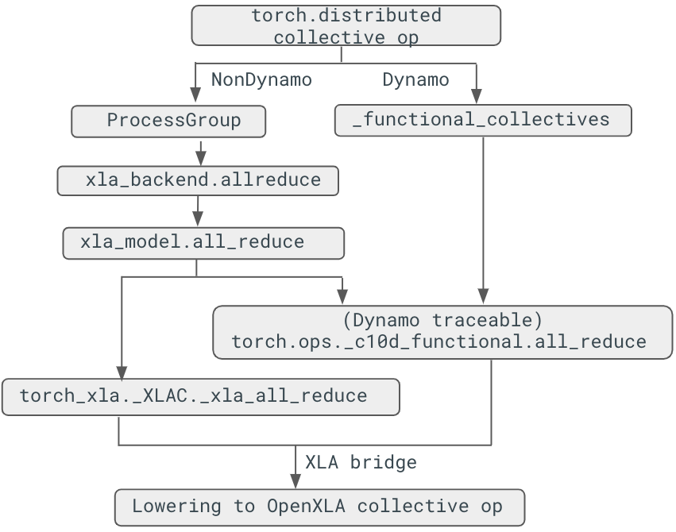

# Support of Torch Distributed API in PyTorch/XLA
PyTorch/XLA version 2.5 adopts the `torch.distributed` API. Before version 2.5 PyTorch/XLA only supported collective ops through the custom `torch_xla.core.xla_model.*` API.  `torch.distributed.*` works whether or not you are using the `torch._dynamo` API.

## Collective ops lowering
### Collective ops lowering stack
PyTorch/XLA version 2.5 introduces the [traceable collective communication APIs](https://github.com/pytorch/pytorch/issues/93173), which enables Dynamo to support collective ops by reimplementing op lowering. Collective ops are traceable through methods defined in the `torch.ops._c10d_functional` namespace. The following figure shows how an `all_reduce` collective op is lowered between `torch` and `torch_xla`:


  

_<span style="text-decoration:underline;">Figure 1. Collective ops lowering stack</span>_

### Non-dynamo collective op lowering
Collective ops are lowered by registering the `ProcessGroupXla` backend:

```Python
# torch_xla/distributed/xla_backend.py
def _create_xla_process_group(prefix_store, rank, size, timeout):
  assert not xr.is_spmd(
  ), "XLA backend is not supported with SPMD. Please use a CPU process group instead."
  return ProcessGroupXla(prefix_store, rank, size, timeout)


def _register_xla_backend():
  dist.Backend.register_backend('xla', _create_xla_process_group, devices='xla')


class ProcessGroupXla(ProcessGroup):
  ...
  def allreduce(self, tensors, all_reduce_options):
    ...
  def allgather(self, output_tensors_list, input_tensors, opts=None):
    ...
```

The `ProcessGroupXla` backend is initialized in the multiprocess function call:
```Python
def _mp_fn(rank):
  dist.init_process_group("xla", init_method='xla://')

With `dist.init_process_group`, collective ops are called based on the process group instance:

  # E.g., pytorch/pytorch/blob/main/torch/distributed/distributed_c10d.py
  @_exception_logger
  def all_gather(tensor_list, tensor, group=None, async_op=False):
    ...
    group = group or _get_default_group()
    work = group.allgather([tensor_list], [tensor]) # uses ProcessGroupXla.allgather instead
```

### Dynamo collective op lowering
When you use dynamo, certain collective ops are remapped to a new function in [pytorch/torch/distributed/_functional_collectives.py](https://github.com/pytorch/pytorch/blob/v2.5.0-rc10/torch/distributed/_functional_collectives.py#L1129-L1150). For example, `all_reduce()` is mapped to `all_reduce_inplace()`, and eventually `torch.ops._c10d_functional.all_reduce()`. Once we reach the _c10d_functional function, we can rewrite the op through PyTorch/XLA lowering:

```C++
at::Tensor all_reduce(const at::Tensor& self, std::string reduceOp,
                      std::string /*group_name*/)  {...}

TORCH_LIBRARY_IMPL(_c10d_functional, XLA, m) {
  m.impl("all_reduce", all_reduce);
}
```


## API description

PyTorch  2.5, supports four collective operations for both Dynamo and non-Dynamo cases. Our goal is to align the distributed operation (dist op) APIs with PyTorch's upstream implementation. One thing to note is that distributed collective ops will not work with the GSPMD, where collective ops are automatically injected at the XLA compiler level. While distributed function signatures remain consistent, certain input restrictions still apply. For instance, specifying multiple process groups for distributed collective operations is not yet supported. For usage examples, refer to [test_collective_ops_tpu.py](https://github.com/pytorch/xla/blob/v2.5.0-rc10/test/pjrt/test_collective_ops_tpu.py), which demonstrates the use of collective ops in both Dynamo and non-Dynamo scenarios.
To use the distributed ops, call  `dist.init_process_group` in your multiprocess function:

```Python
import torch.distributed as dist
import torch_xla
def _mp_fn(rank):
  dist.init_process_group("xla", init_method='xla://')
  ...

if __name__ == '__main__':
  torch_xla.launch(_mp_fn)

```
Below are the details for collective operation functions:
```Python
dist.all_reduce(input: torch.Tensor, op: dist.ReduceOp = ReduceOp.SUM)
```
`all_reduce` performs an in-place reduction on the `input` tensor by aggregating data from all nodes.

```Python
dist.all_gather_into_tensor(output, input)
```
`all_gather_into_tensor` gathers the input tensor from all nodes and updates the `output` tensor in-place. It also returns an alias of the output.

```Python
dist.reduce_scatter_tensor(output, input, op: dist.ReduceOp = ReduceOp.SUM)
```
`reduce_scatter_tensor` reduces the input tensor across all nodes and distributes the result to the `output` tensor in-place. It returns an alias of the output.

```Python
dist.all_to_all_single(output, input, output_split_sizes=None, input_split_sizes=None)
```
`all_to_all_single` function performs an all-to-all communication, updating the output tensor in-place and returning its alias.

Note: Although `output_split_sizes` and `input_split_sizes` are accepted as arguments, they must be either None or set to all 1s. This limitation reflects a compromise between maintaining PyTorch’s API signature and the constraints of the XLA AllToAll operation.
