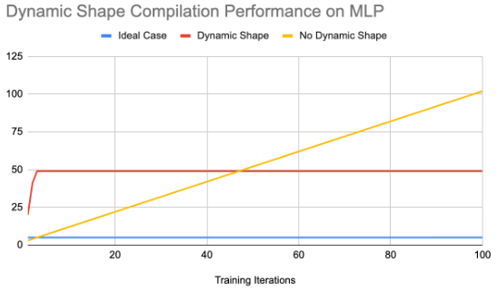

# Dynamic shape

Dynamic shape refers to the variable nature of a tensor shape where its shape depends on the value of another upstream tensor. For example:
```
>>> import torch, torch_xla
>>> in_tensor  = torch.randint(low=0, high=2, size=(5,5), device='xla:0')
>>> out_tensor = torch.nonzero(in_tensor)
```
the shape of `out_tensor` depends on the value of `in_tensor` and the shape is bounded by the shape of `in_tensor`. In other words, 
```
>>> print(out_tensor.shape)
torch.Size([<=25, 2])
```
You can see the first dimension depends on the value of `in_tensor` and its maximum value is 25. We call the first dimension as dynamic dimension. The second dimension does not depend on any upstream tensors so we call it static dimension.

Dynamic shape can be further categorized into bounded dynamic shape and unbounded dynamic shape.
- bounded dynamic shape: refers to a shape whose dynamic dimensions are bounded by static values. It works for accelerators that require static memory allocation (e.g. TPU).
- unbounded dynamic shape: refers to shape whose dynamic dimensions can be infinitely large. It works for accelerators that don’t require static memory allocation (e.g. GPU).

Today, only bounded dynamic shape is supported and it is in experimental phase.

## Bounded dynamic shape

Currently, we support multi-layer perceptron model (MLP) with dynamic size input on TPU.

This feature is controlled by a flag `XLA_EXPERIMENTAL="nonzero:masked_select"`. To run a model with the feature enabled, you can do:
```
XLA_EXPERIMENTAL="nonzero:masked_select:masked_scatter" python your_scripts.py
```

Here are some numbers we get when we run the MLP model for 100 iterations:

|             | No dynamic shape  | With dynamic shape     |
| :---        |    :----:         |          ---: |
| End-to-end training time | 29.49             | 20.03   |
| Number of compilations   | 102               | 49      |
| Compilation cache hit    | 198               | 1953      |


_<span style="text-decoration:underline;">Figure 1. Performance comparison (a) without dynamic shape  (b) with dynamic shape </span>_
