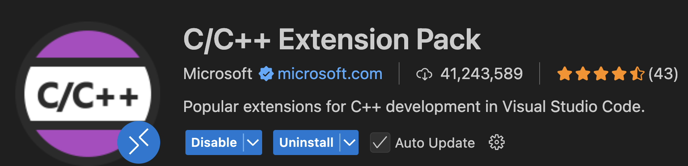
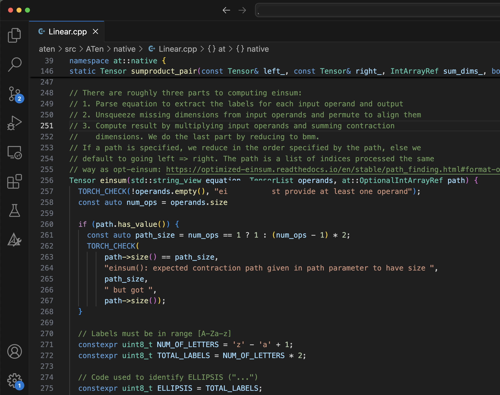
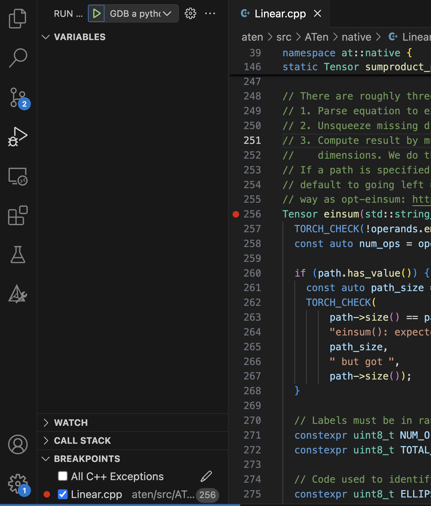
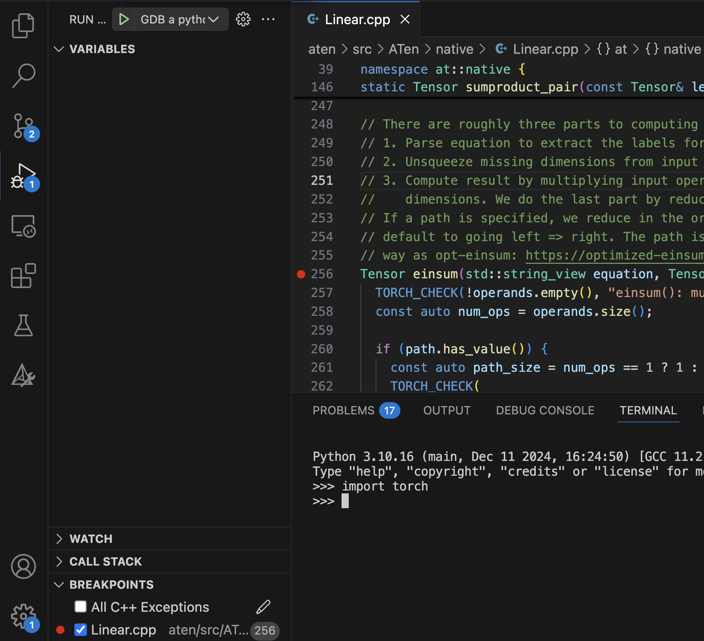

# C++ Debugging

This guide shows you how build your PyTorch C++ code with debugging symbols, and
how to debug PyTorch using GDB or LLDB with VSCode.

## Why would you need this?

This guide is for contributors to PyTorch or PyTorch/XLA who use C++ to build
features like [custom C++ operations](https://pytorch.org/tutorials/advanced/cpp_custom_ops.html).

## Install GDB: The GNU Project Debugger

You can install GDB using the [official instructions](https://www.sourceware.org/gdb/).
If you are using a conda environment, you can also install GDB with the following
command:

``` sh
conda install -c conda-forge gdb
```

## Building PyTorch with Debugging Symbols

Debugging options are described in [setup.py on GitHub](https://github.com/pytorch/pytorch/blob/300e0ee13c08ef77e88f32204a2e0925c17ce216/setup.py#L2C1-L11C53):

``` python
# Environment variables you are probably interested in:
#
#   DEBUG
#     build with -O0 and -g (debug symbols)
#
#   [...]
#
#   USE_CUSTOM_DEBINFO="path/to/file1.cpp;path/to/file2.cpp"
#     build with debug info only for specified files
```

When defined, the `DEBUG` will cause the build process to generate debug symbols
for all source files. It will also prevent the compiler from performing any
optimizations, which will cause the geenrated binary to run too slow to perform
meaningful work. We recommend using the `USE_CUSTOM_DEBINFO` environment variable
to specify a semicolon separated list of source files for which you want to
generate debug symbols. This lets you generate debug symbols for only the source
files you want to debug. All other source files are built and optimized as usual.

We suggest the following steps:

1. Identify the source file you want to debug.
1. Build that file with debug symbols using a command similar to `USE_CUSTOM_DEBINFO="aten/src/ATen/native/Linear.cpp" python setup.py develop`.
1. Set a breakpoint and start a debugger session. As you debug you will discover
   additional files you want to debug.
1. Add those files to the `USE_CUSTOM_DEBINFO` environment variable.
1. Rebuild with a command similar to `USE_CUSTOM_DEBINFO="aten/src/ATen/native/Linear.cpp;newfile.cpp" python setup.py develop`.
1. Start your debugger session again.

At this point, your PyTorch is built with debugging symbols and ready to debug
with GDB. However, we recommend debugging with VSCode. For more information, see
{ref}`Debug with VSCode`.

### Verify your file is built

For PyTorch, we recommend you do a full clean and rebuild each time.
Unfortunately, touching a file to update its timestamp does not reliably cause
that file to be rebuilt.

In the output of the `python setup.py develop` command, look for a line that
starts with `Source files with custom debug infos` to make sure your file was
built with debug symbols. For example:

``` sh
--  USE_ROCM_KERNEL_ASSERT : OFF
-- Performing Test HAS_WMISSING_PROTOTYPES
-- Performing Test HAS_WMISSING_PROTOTYPES - Failed
-- Performing Test HAS_WERROR_MISSING_PROTOTYPES
-- Performing Test HAS_WERROR_MISSING_PROTOTYPES - Failed
-- Source files with custom debug infos: aten/src/ATen/Utils.cpp aten/src/ATen/ScalarOps.cpp aten/src/ATen/EmptyTensor.cpp aten/src/ATen/core/Tensor.cpp aten/src/ATen/native/Linear.cpp
```

Before you start a new debug session, make sure you have shut down any previous
debug sessions.

## VSCode Configuration

To use VSCode for debugging, you must install the C/C++ Extension Pack,
published by Microsoft. Search for `ms-vscode.cpptools-extension-pack` in the
VSCode *Extensions* tab.



Next, create a file named `launch.json` in the `pytorch/.vscode` folder. The
following is a sample file to start from. You'll need to adjust the file paths
to match your specific installation.

```json
{
    "version": "0.2.0",
    "configurations": [
        {
            "name": "GDB a python interpreter",
            "type": "cppdbg",
            "request": "launch",
            "program": "/home/USERNAME/miniconda3/envs/torch310/bin/python", // Replace with your executable's path
            "args": [],
            "cwd": "${workspaceFolder}",
            "environment": [],
            "externalConsole": false,
            "MIMode": "gdb",
            "setupCommands": [
                {
                    "description": "Enable pretty-printing for gdb",
                    "text": "-enable-pretty-printing",
                    "ignoreFailures": true
                },
                {
                    "description": "Set Disassembly flavor to Intel",
                    "text": "-gdb-set disassembly-flavor intel",
                    "ignoreFailures": true
                }
            ],
            // "preLaunchTask": "C/C++: g++ build active file",
            "miDebuggerPath": "/home/USERNAME/miniconda3/envs/torch310/bin/gdb" // Replace with your gdb location
        }
    ]
 }
 ```

## LLDB

You can also debug with LLDB. In our experience, LLDB is faster. But both have
their quirks, and you may benefit from switching between the two.

Install LLDB for VSCode by searching for `vadimcn.vscode-lldb` in the VSCode
*Extensions*.

Then add the following snippet to your launch.json file:

``` json
    {
        "name": "LLDB Python",
        "type": "lldb",
        "request": "launch",
        "program": "/home/your-user-id/miniconda3/envs/torch310/bin/python",

    }
```

Replace the value for `program` with the path to `python` in your virtual
environment.

## Debug with VSCode

1. Open the file you want to debug.

    

1. Click to the left of the line number to set a breakpoint. A red dot is
   displayed indicating the breakpoint has been set. The breakpoint will also
   be listed in the debugger tab.

    

1. Select the GDB or LLDB configuration using the dropdown to the right of the
    green play button.

1. Click the green play button to start the debugging session. The debugger
    processes the rules set in the `launch.json` file.

    After starting the debug session, the red dot will change to an empty white
    circle indicated `torch` symbols have not been loaded.

    

1. In the python interpreter, `import torch`. This loads the `torch` library you
    built. The breakpoints are displayed as red dots again.

    

1. Run a command that will trigger the breakpoint, for example, `torch.einsum()`.
    A yellow arrow indicates the current file location. Variable and call stack
    information is displayed on the left.

    

## A realistic build command

Over time, you'll collect additional flags for your build command, such as not
building certain libraries to speed up builds, or adding diagnostics. The following
settings turns off building CUDA and turns on handling an environment variable
to print dispatcher traces.

``` sh
USE_CUSTOM_DEBINFO="aten/src/ATen/native/Linear.cpp" USE_CUDA=0 LD_LIBRARY_PATH=/home/USERNAME/miniconda3/envs/torch310/lib CFLAGS="-DHAS_TORCH_SHOW_DISPATCH_TRACE" python setup.py develop
```

## Future Work

This guide has demonstrated how to build debugging symbols for PyTorch C++ files.
Future work will demonstrate adding debugging symbols to PyTorch/XLA C++ files.
