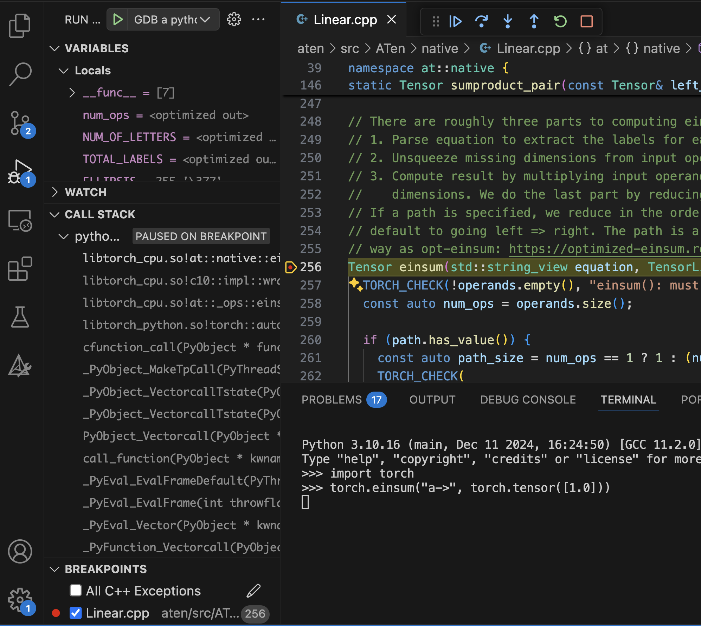

# C++ Debugging in VSCode

PyTorch has good support for C++ debugging. This guide walks you through how to utilize it and integrate it with VSCode.

## Why would you need this?

This guide is for contributors to PyTorch or PyTorch/XLA who need to touch the C++ internals to build features like [custom C++ operations](https://pytorch.org/tutorials/advanced/cpp_custom_ops.html). 

## Install GDB: The GNU Project Debugger

The official instructions are [here](https://www.sourceware.org/gdb/) but if you are in a conda environment, you can
install it as

``` sh
conda install -c conda-forge gdb
```

## VSCode Configuration

Integrating with VSCode will require installing the C/C++ Extension Pack, published by Microsoft. Search in the Extensions tab of VSCode with the identifier `ms-vscode.cpptools-extension-pack`.


Next, you'll need to create a `launch.json` in the `pytorch/.vscode` folder. Here is
a sample file to start from. You'll need to adjust the file paths to match your specific installation.

``` json
{
    "version": "0.2.0",
    "configurations": [
        {
            "name": "GDB a python interpreter",
            "type": "cppdbg",
            "request": "launch",
            "program": "/home/USERNAME/miniconda3/envs/torch310/bin/python", // Replace with your executable's path
            "args": [],
            "cwd": "${workspaceFolder}",
            "environment": [],
            "externalConsole": false,
            "MIMode": "gdb",
            "setupCommands": [
                {
                    "description": "Enable pretty-printing for gdb",
                    "text": "-enable-pretty-printing",
                    "ignoreFailures": true
                },
                {
                    "description": "Set Disassembly flavor to Intel",
                    "text": "-gdb-set disassembly-flavor intel",
                    "ignoreFailures": true
                }
            ],
            // "preLaunchTask": "C/C++: g++ build active file",
            "miDebuggerPath": "/home/USERNAME/miniconda3/envs/torch310/bin/gdb" // Replace with your gdb location
        }
    ]
 }
 ```

## Building with Debugging Symbols

Looking into `setup.py`, we see

``` python
# Environment variables you are probably interested in:
#
#   DEBUG
#     build with -O0 and -g (debug symbols)
#
#   REL_WITH_DEB_INFO
#     build with optimizations and -g (debug symbols)
#
#   USE_CUSTOM_DEBINFO="path/to/file1.cpp;path/to/file2.cpp"
#     build with debug info only for specified files
```
[source](https://github.com/pytorch/pytorch/blob/300e0ee13c08ef77e88f32204a2e0925c17ce216/setup.py#L2C1-L11C53)

Setting `DEBUG` will result in a very slow binary, since every single file will
be unoptimized (`-O0`) and built with debugging symbols. 

In practice, you'll want to set the `USE_CUSTOM_DEBINFO` instead. 

The challenge becomes knowing which files to build with debugging symbols. A common issue will be debugging a file, then realizing you want to look at data structures or another
function call in a file that's not built with debugging symbols. 

Your basic flow as you get started is:

1. Identify the source file you want to debug.
2. Build that file with debugger symbols
3. Start a debugger session with a breakpoint. You'll discover additional files you want to debug. 
4. Add those files to the `USE_CUSTOM_DEBINFO`
5. Rebuild those files
6. Rebuild with a command similar to `USE_CUSTOM_DEBINFO="aten/src/ATen/native/Linear.cpp;newfile.cpp" python setup.py develop`
7. Start your debugger session again. 

Again, the key line environment variable to set is `USE_CUSTOM_DEBINFO`.

## Ensuring your file is built

In our experience, you'll need to do a full clean and rebuild each time. 

In the output of the `python setup.py develop` command, look for a line that starts with `Source files with custom debug infos`
to make sure your file is correctly being built with debugger symbols. For example:

``` sh
--   Public CUDA Deps.    : 
--   Private CUDA Deps.   : 
--   USE_COREML_DELEGATE     : OFF
--   BUILD_LAZY_TS_BACKEND   : ON
--   USE_ROCM_KERNEL_ASSERT : OFF
-- Source files with custom debug infos: torch/nn/functional.py
-- Configuring done (11.2s)
-- Generating done (1.4s)
-- Build files have been written to: /home/yho_google_com/pytorch/build
[6/34] Building CXX object caffe2/CMakeFiles/torch_cpu.dir/__/aten/src/ATen/native/mkldnn/...
```

It may also be helpful to ensure that your previous debugger session is shut down.  

## Using VSCode's Visual Debugger

First, open the file you want to debug.


Second, click to the left of the line number you want to set a breakpoint. You'll see a red dot there, and, in the lower left of the debugger tab.


Third, start the debugger session with the green play button. This triggers the rules we
set in the launch.json file. Notice that the red button now fades to an empty white circle. That's because you have an active session, but the debugger does not know if it will actually break there. The reason is that you have not imported torch yet, so the torch library you built with debugger symbols is not yet loaded. 


In the python interpretor, `import torch`. Now, the breakpoints are active because
torch has loaded the underlying C++ libraries. 


Run a command that will trigger the breakpoint, namely, `torch.einsum()`. Notice the yellow arrow indicating the current file location, and the variables and call stack information on the left. You are debugging! 



## A realistic build command

As you build, you'll collect additional special flags to speed things up, like not building certain libraries or adding diagnostics. Here is one example:

``` sh
USE_CUSTOM_DEBINFO="aten/src/ATen/native/Linear.cpp" USE_CUDA=0 LD_LIBRARY_PATH=/home/USERNAME/miniconda3/envs/torch310/lib CFLAGS="-DHAS_TORCH_SHOW_DISPATCH_TRACE" python setup.py develop
```

## Future Work

This guide has demonstrated how to build debugging symbols for PyTorch. However, comparable flags are not available in the PyTorch/XLA build scripts yet. Future work will include adding those debugger symbol flags so contributors can debug not just PyTorch C++ files, but also PyTorch/XLA C++ files. 