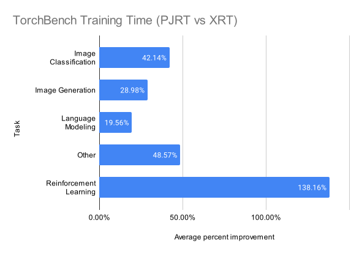
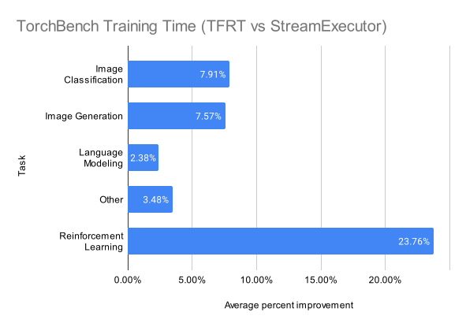

# PJRT Runtime

PyTorch/XLA has migrated from the TensorFlow-based XRT runtime to the
[PJRT runtime](https://github.com/openxla/xla/tree/main/xla/pjrt) used
by [JAX](https://github.com/google/jax).

If you encounter a bug with PJRT, please file an issue on GitHub with
the `runtime` tag.

*New features in PyTorch/XLA r2.1*:

-   PJRT is stable in PyTorch/XLA r2.1!
-   Public runtime APIs have moved from `torch_xla.experimental.pjrt` to
    `torch_xla.runtime`.
    -   The `pjrt://` init method has been renamed to `xla://`, and it
        is registered by `torch_xla.distributed.xla_backend`.
    -   The previous `torch_xla.experimental.*` names are still
        available in this release for compatibility.
-   `torchrun` is now supported when using `init_method='xla://'`.
-   New plugins for XPU and Neuron via the PJRT C API.

*New features in PyTorch/XLA r2.0*:

-   PJRT will be configured by default if you don't pass in any other
    runtime configuration. If you continue to set XRT configuration
    (`XRT_TPU_CONFIG`), this change has no impact
-   New TPU runtime implementation in `libtpu` improves performance by
    up to 30%.
-   New `xm.rendezvous` implementation that scales to thousands of TPU
    cores
-   \[experimental\] `torch.distributed` support for TPU v2 and v3,
    including `pjrt://` `init_method`

## TL;DR

-   To use the PJRT preview runtime, set the `PJRT_DEVICE` environment
    variable to `CPU`, `TPU`, or `CUDA`
-   In XRT, all distributed workloads are multiprocess, with one process
    per device. On TPU v2 and v3 in PJRT, workloads are multiprocess and
    multithreaded (4 processes with 2 threads each), so your workload
    should be thread-safe. See [Multithreading on TPU
    v2/v3](#multithreading-on-tpu-v2v3) and the [Multiprocessing section
    of the API
    guide](https://github.com/pytorch/xla/blob/master/API_GUIDE.md#running-on-multiple-xla-devices-with-multi-processing)
    for more information. Key differences to keep in mind:
    -   To initialize a model in a thread-safe way, either broadcast the
        parameters across replicas after initialization
        (`torch_xla.experimental.pjrt.broadcast_master_param`) or load
        each replica's parameters from a common checkpoint.
    -   For other random number generation, use `torch.Generator` where
        possible. The global `torch` RNG is *not* thread-safe, even if
        you set the same `torch.manual_seed` across replicas.
    -   To use `torch.distributed`, import
        `torch_xla.experimental.pjrt_backend` and use the `xla://`
        `init_method`.
    -   These steps are optional for GPU and TPU v4.

Sample diff from XRT to PJRT:

``` diff
import os

import torch
import torch.nn as nn
from torch.nn.parallel import DistributedDataParallel as DDP
import torch.optim as optim
import torch.distributed as dist
import torch_xla
import torch_xla.core.xla_model as xm
import torch_xla.distributed.parallel_loader as pl
import torch_xla.distributed.xla_backend
+import torch_xla.runtime as xr


def _mp_fn(index):
  device = xm.xla_device()
-  dist.init_process_group('xla', rank=xr.global_ordinal(), world_size=xr.world_size())
+  dist.init_process_group('xla', init_method='xla://')

  torch.manual_seed(42)
  model = nn.Linear(128, 10).to(device)

+  # Optional for TPU v4 and GPU
+  xm.broadcast_master_param(model)
  model = DDP(model)

  loss_fn = nn.MSELoss()
  optimizer = optim.SGD(model.parameters(), lr=.001)

  for i in range(10):
    data, target = torch.randn((128, 128), device=device), torch.randn((128, 10), device=device)

    optimizer.zero_grad()
    output = model(data)
    loss = loss_fn(output, target)
    loss.backward()

    optimizer.step()
    xm.mark_step()

  # Print mean parameters so we can confirm they're the same across replicas
  print([p.mean() for p in model.parameters()])

if __name__ == '__main__':
-  os.environ['XRT_TPU_CONFIG'] = 'localservice;0;localhost:51011'
-  os.environ['MASTER_ADDR'] = 'localhost'
-  os.environ['MASTER_PORT'] = '12355'

+  # Recommended: set PJRT_DEVICE to your local device type
+  os.environ['PJRT_DEVICE'] = 'TPU'

  torch_xla.launch(_mp_fn)
```

## Benefits

-   Simple runtime configuration: just set `PJRT_DEVICE` to `TPU`,
    `CPU`, or `CUDA` and start using XLA! Or, let PJRT select a device
    automatically based on your environment.
-   Improved performance: reduced overhead from gRPC means faster
    end-to-end execution. On TorchBench 2.0, we observed a \>35%
    improvement in training time on TPU v4.
-   Easy pod execution: just copy your code to each TPU worker, and
    execute them all at the same time with
    `gcloud compute tpus tpuvm ssh --worker=all`.
-   Better scaling: removes [XRT's limitation on parameter
    sizes](https://github.com/pytorch/xla/pull/3920) and supports up to
    2048 TPU chips.

## Quickstart

To start using PJRT with PyTorch/XLA, all you need to do is set the
`PJRT_DEVICE` environment variable. If you're working on a TPU v2 or v3,
keep reading to learn about the differences between TPU v2 and v3 and
v4.

### CPU

On any machine with PyTorch/XLA installed, you can run our MNIST example
on CPU like this:

    PJRT_DEVICE=CPU python3 xla/test/test_train_mp_mnist.py --fake_data

### TPU

To create a new TPU with PyTorch/XLA r2.0 installed:

    gcloud alpha compute tpus tpu-vm create $USER-pjrt --accelerator-type=v4-8 --version=tpu-vm-v4-pt-2.0 --zone=us-central2-b --project=$PROJECT

On a v4-8, you can run our ResNet50 example like this:

    git clone --depth=1 --branch r2.0 https://github.com/pytorch/xla.git
    PJRT_DEVICE=TPU python3 xla/test/test_train_mp_imagenet.py --fake_data --batch_size=256 --num_epochs=1

By default, PJRT will use all TPU chips. To use only one TPU chip,
configure `TPU_PROCESS_BOUNDS` and `TPU_VISIBLE_CHIPS`:

    TPU_PROCESS_BOUNDS=1,1,1 TPU_VISIBLE_CHIPS=0 PJRT_DEVICE=TPU python3 xla/test/test_train_mp_imagenet.py --fake_data --batch_size=256 --num_epochs=1

#### Pods

On TPU Pods, use `gcloud` to run your command on each TPU in parallel:

    gcloud alpha compute tpus tpu-vm ssh $USER-pjrt --zone=us-central2-b --project=$PROJECT --worker=all --command="git clone --depth=1 --branch r1.13 https://github.com/pytorch/xla.git"
    gcloud alpha compute tpus tpu-vm ssh $USER-pjrt --zone=us-central2-b --project=$PROJECT --worker=all --command="PJRT_DEVICE=TPU python3 xla/test/test_train_mp_imagenet.py --fake_data --batch_size=256 --num_epochs=1"

#### Docker

You can also use Docker to run your workload in a container with
PyTorch/XLA preinstalled:

    export DOCKER_IMAGE=gcr.io/...

    # Optional: authenticate docker if your image is in a private GCP repository
    gcloud compute tpus tpu-vm ssh $USER-pjrt --zone=us-central2-b --project=$PROJECT --worker=all --command "sudo gcloud auth configure-docker"

    # Run your workload
    gcloud compute tpus tpu-vm ssh $USER-pjrt --zone=us-central2-b --project=$PROJECT --worker=all --command "sudo docker run --rm --privileged --net=host -e PJRT_DEVICE=TPU $DOCKER_IMAGE python pytorch/xla/test/test_train_mp_imagenet.py --fake_data"

Note that `docker run` requires privileged access to the host
(`--privileged`) to expose the TPU device to the container. Docker on
TPU pods is only supported with host networking `--net=host` at this
time. See the [Cloud TPU
documentation](https://cloud.google.com/tpu/docs/run-in-container) for
more information.

### GPU

### Single-node GPU training

To use GPUs with PJRT, simply set `PJRT_DEVICE=CUDA` and configure
`GPU_NUM_DEVICES` to the number of devices on the host. For example:

    PJRT_DEVICE=CUDA GPU_NUM_DEVICES=4 python3 xla/test/test_train_mp_imagenet.py --fake_data --batch_size=128 --num_epochs=1

You can also use `torchrun` to initiate the single-node multi-GPU
training. For example,

    PJRT_DEVICE=CUDA torchrun --nnodes 1 --nproc-per-node ${NUM_GPU_DEVICES} xla/test/test_train_mp_imagenet.py --fake_data --pjrt_distributed --batch_size=128 --num_epochs=1

In the above example, `--nnodes` means how many machines (physical
machines or VMs) to be used (it is 1 since we do single-node training).
`--nproc-per-node` means how many GPU devices to be used.

### Multi-node GPU training

**Note that this feature only works for cuda 12+**. Similar to how
PyTorch uses multi-node training, you can run the command as below:

    PJRT_DEVICE=CUDA torchrun \
    --nnodes=${NUMBER_GPU_VM} \
    --node_rank=${CURRENT_NODE_RANK} \
    --nproc_per_node=${NUMBER_LOCAL_GPU_DEVICES} \
    --rdzv_endpoint=<internal_ip_address:port> multinode_training.py

-   `--nnodes`: how many GPU machines to be used.
-   `--node_rank`: the index of the current GPU machines. The value can
    be 0, 1, ..., \${NUMBER_GPU_VM}-1.
-   `--nproc_per_node`: the number of GPU devices to be used on the
    current machine.
-   `--rdzv_endpoint`: the endpoint of the GPU machine with
    node_rank==0, in the form `host:port`. The `host` will be the
    internal IP address. The `port` can be any available port on the
    machine. For single-node training/inference, this parameter can be
    omitted.

For example, if you want to train on 2 GPU machines: machine_0 and
machine_1, on the first GPU machine machine_0, run

    # PJRT_DEVICE=CUDA torchrun \
    --nnodes=2 \
    --node_rank=0 \
    --nproc_per_node=4 \
    --rdzv_endpoint="<MACHINE_0_INTERNAL_IP_ADDRESS>:12355" pytorch/xla/test/test_train_mp_imagenet.py  --fake_data --pjrt_distributed --batch_size=128 --num_epochs=1

On the second GPU machine, run

    # PJRT_DEVICE=CUDA torchrun \
    --nnodes=2 \
    --node_rank=1 \
    --nproc_per_node=4 \
    --rdzv_endpoint="<MACHINE_0_INTERNAL_IP_ADDRESS>:12355" pytorch/xla/test/test_train_mp_imagenet.py  --fake_data --pjrt_distributed --batch_size=128 --num_epochs=1

the difference between the 2 commands above are `--node_rank` and
potentially `--nproc_per_node` if you want to use different number of
GPU devices on each machine. All the rest are identical. For more
information about `torchrun`, please refer to this
[page](https://pytorch.org/docs/stable/elastic/run.html).

## Differences from XRT

Although in most cases we expect PJRT and XRT to work mostly
interchangeably from the end-user's perspective (especially on TPU v4),
there are some subtle differences that are important to keep in mind.
Importantly, XRT was designed around the TPU Node architecture, so it
will always spawn a client and a server process, even on TPU VMs. Thus,
every batch of inputs has additional latency from serializing and
deserializing data to send it over the network.

PJRT uses the local device directly with no intermediate server process.
In the default configuration, PJRT will create one process per TPU chip,
or 4 processes per TPU host. See the [Cloud TPU
documentation](https://cloud.google.com/tpu/docs/system-architecture-tpu-vm)
for more information about TPU architecture.

-   Performance gains are possible for workloads constrained overhead
    from .
-   Under XRT, the server process is the only process that interacts
    with the TPU devices, and client processes don't have direct access
    to the TPU devices. When profiling a single-host TPU (e.g. v3-8 or
    v4-8), you would normally see 8 device traces (one for each TPU
    core). With PJRT, each process has one chip, and a profile from that
    process will show only 2 TPU cores.
    -   For the same reason, profiling does not work on TPU Pods with
        XRT, because the server process runs independently from the
        user's model code. PJRT does not have that constraint, so it is
        possible to profile 2 TPU cores per process in a TPU Pod.
-   PJRT only supports the TPU VM architecture and we have no plans to
    support the TPU Node architecture with PJRT.
-   Runtime configuration is significantly simpler with PJRT. `xla_dist`
    is not required to run TPU Pod workloads. Instead, copy your code to
    each TPU host
    (`[gcloud compute tpus tpu-vm   scp](https://cloud.google.com/sdk/gcloud/reference/alpha/compute/tpus/tpu-vm/scp)`)
    and run the code on each host in parallel
    (e.g. `[gcloud compute tpus tpu-vm   ssh --workers=all --command="PJRT_DEVICE=TPU python   run.py"](https://cloud.google.com/sdk/gcloud/reference/alpha/compute/tpus/tpu-vm/ssh)`)
-   `xm.rendezvous` has been reimplemented using XLA-native collective
    communication to enhance stability on large TPU pods. See below for
    more details.

### Multithreading on TPU v2/v3

On TPU v2 and v3, **distributed workloads always run multithreaded**,
since each TPU core exposes two TPU cores as devices and only one
process may open a TPU chip at a time. In its default configuration,
`xmp.spawn` automatically spawns as many processes as possible (4 per
TPU host) and creates two threads per process (one per TPU core).

Note: on TPU v4, each TPU chip is represented as one PyTorch device, so
distributed workloads will run across 4 processes, each with only one
thread. This is identical to XRT's behavior.

In most cases, this will not require substantial changes to your
existing code. The main change you will have to make in most cases is to
model initialization. Because `torch`'s global RNG is shared between
threads, results will vary between threads and runs even if you set
`torch.manual_seed` to the same value in every replica. To get
consistent parameters between replicas, either use
`torch_xla.experimental.pjrt.broadcast_master_param` to broadcast one
replica's parameters to all other replicas, or load each replica's
parameters from a common checkpoint.

### Changes to xm.rendezvous

*New in PyTorch/XLA r2.0*

With XRT, worker 0 runs a mesh master service, and all processes on all
workers connect to that service over gRPC. In practice, we found that
running a single mesh master process was unreliable on TPU pods with
thousands of chips due to the number of inbound connections to worker 0.
A single client process timing out could cause a failure and force the
entire workload to restart.

Thus, we have reimplemented `xm.rendezvous` with native XLA collective
communication, which is much more stable and well-tested on large TPU
pods. This imposes two new constraints compared to the XRT
implementation:

-   Because the payload has to become part of the XLA graph,
    `xm.mark_step` is called both before and after the data is
    transferred. Calling `xm.rendezvous` in the middle of model code may
    force an unwanted compilation.
-   Because XLA does not permit collective operations to run on a subset
    of workers, all workers must participate in the `rendezvous`.

If you require the old behavior of `xm.rendezvous` (i.e. communicating
data without altering the XLA graph and/or synchronizing a subset of
workers), consider using `` `torch.distributed.barrier ``
\<<https://pytorch.org/docs/stable/distributed.html#torch.distributed.barrier>\>[\_\_
or ]{.title-ref}`torch.distributed.all_gather_object`
\<<https://pytorch.org/docs/stable/distributed.html#torch.distributed.all_gather_object>\>[\_\_
with a ]{.title-ref}[gloo]{.title-ref}[ process group. If you are also
using the ]{.title-ref}[xla]{.title-ref}[
]{.title-ref}[torch.distributed]{.title-ref}[ backend, you can use
]{.title-ref}[torch.new_group]{.title-ref}[ to create a
]{.title-ref}[gloo]{.title-ref}[ subgroup. See \`this example
\<https://pytorch.org/docs/stable/distributed.html#monitored-barrier\>]{.title-ref}\_\_
from the PyTorch documentation. Keep in mind these constraints:

-   `torch.distributed` is not fully supported on TPU v2/v3. Only a
    subset of operations with the `xla` backend are implemented, and
    `gloo` will likely not work as expected in a multithreaded context.
-   In our experiments, `gloo` does not scale well to thousands of TPU
    chips, so expect this alternative to be less reliable than using
    `xm.rendezvous` with PJRT at large scales.

### PJRT and torch.distributed

*New in PyTorch/XLA r2.0*

When using PJRT with `torch.distributed` and
`[torch.nn.parallel.DistributedDataParallel](https://github.com/pytorch/xla/blob/master/docs/ddp.md)`
we strongly recommend using the new `xla://` `init_method`, which
automatically finds the replica IDs, world size, and master IP by
querying the runtime. For example:

``` python
import torch
import torch_xla
import torch.distributed as dist
import torch_xla.core.xla_model as xm
from torch_xla.experimental import pjrt

# Required for `xla://` init_method and `xla` backend
import torch_xla.distributed.xla_backend

def _all_gather(index: int):
  # No need to pass in `rank` or `world_size`
  dist.init_process_group('xla', init_method='xla://')

  t = torch.tensor([index], dtype=torch.int32, device=xm.xla_device())
  output = [torch.zeros_like(t) for _ in range(dist.get_world_size())]
  dist.all_gather(output, t)

  xm.mark_step()
  print(output)

if __name__ == '__main__':
  torch_xla.launch(_all_gather)
```

Note: Although the `xla://` init_method is not required on TPU v4, it is
still recommended. If you use `env://`, `MASTER_ADDR` must be set to IP
host that has device 0, which is *not* always worker 0. The `xla://`
init_method finds this IP automatically.

Note: For TPU v2/v3, you still need to import
`torch_xla.experimental.pjrt_backend`, as TPU v2/v3 support in
`torch.distributed` is still experimental.

For more information about using `DistributedDataParallel` on
PyTorch/XLA, see [ddp.md](./ddp.md) on TPU V4. For an example that uses
DDP and PJRT together, run the following [example
script](../test/test_train_mp_imagenet.py) on a TPU:

``` bash
PJRT_DEVICE=TPU python xla/test/test_train_mp_mnist.py --ddp --pjrt_distributed --fake_data --num_epochs 1
```

## Performance

TorchBench shows improvements in average training time across tasks with
PJRT compared to XRT, with an average improvement of over 35% on TPU
v4-8. The benefits vary significantly by task and model type, ranging
from 0% to 175%. The following chart shows the breakdown by task:



### New TPU runtime

*New in PyTorch/XLA r2.0*

The PyTorch/XLA r2.0 release introduces support for the [PJRT Plugin
API](https://github.com/openxla/community/blob/main/rfcs/20230123-pjrt-plugin.md#rfc-openxla-pjrt-plugin),
used to access the new TFRT-based TPU runtime in `libtpu`. This is now
the default runtime when `PJRT_DEVICE=TPU` is set. The legacy
StreamExecutor-based TPU runtime used in 1.13 will still be available
with `PJRT_DEVICE=TPU_LEGACY` in the 2.0 release, but it will be removed
in a future version. If you encounter an issue that only happens on
`TPU` and not `TPU_LEGACY`, please file an issue on GitHub.

In most cases, we expect performance to be similar between the two
runtimes, but in some cases, the new runtime may be up to 30% faster.
The following chart shows the breakdown by task:



Note: the improvements shown in this chart are also included in the PJRT
vs XRT comparison.
