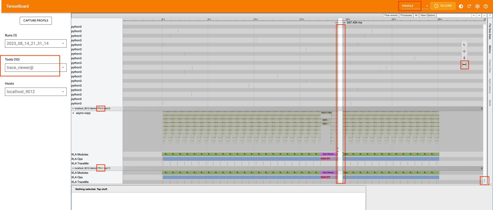
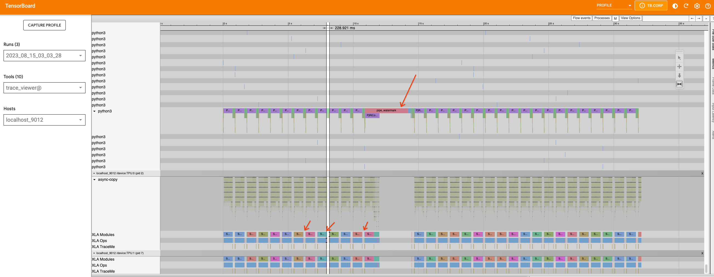

# Profiling and performance analysis

To investigate model performance, you can profile it using the profiling
[guide](https://cloud.google.com/tpu/docs/pytorch-xla-performance-profiling-tpu-vm).
As a rule of thumb, the profiling script should be run with the maximum
batch size that fits into the memory for [optimal memory
usage](https://cloud.google.com/tpu/docs/performance-guide). It also
helps to overlap tracing of the code with device execution which leads
to optimal device usage. The profile duration should be long
enough to capture at least one step. Good performance of the model on
TPUs means that device-host communication is minimized and the device is
constantly running processes with minimal idle time.

Starting a server in the `inference_tpu_*.py` file and running
`capture_profile.py` script as described in the guide will give us
information on processes that run on the devices. Currently, only one
XLA device is profiled. To better understand the TPU idle time (gaps in
the profile), add profiling traces (`xp.Trace()`) to the
code. The `xp.Trace()` measures the time it takes to trace the python
code on the host machine wrapped with the trace. For this example,
`xp.Trace()` traces were added inside the
[pipeline](https://github.com/ssusie/diffusers/blob/main/src/diffusers/pipelines/stable_diffusion_xl/pipeline_stable_diffusion_xl.py)
and the [U-net
model](https://github.com/ssusie/diffusers/blob/main/src/diffusers/models/unet_2d_condition.py)
to measure the time to run specific sections of the code on the host
(CPU).

If the gaps in the profile are due to Python code tracing that happens
on the host, then this might be a bottleneck and there is no further
straightforward optimization that can be done. Otherwise, the code
should be analyzed further to understand the caveats and improve the
performance further. Note that you cannot `xp.Trace()` wrap portions of
the code where `torch_xla.sync()` is called.

To illustrate this we can look at already captured profiles that were
uploaded to tensorboard following the profiling guide.

Starting from Stable Diffusion model version 2.1

If we capture a profile without inserting any traces, we will see the
following:

The single TPU device on v4-8, which has two cores, appears to be busy.
There are no significant gaps in their usage, except for a small one in
the middle. If we scroll up to try to find which process is occupying
the host machine, we will not find any information. Therefore, we will
add `xp.traces` to the pipeline
[file](https://github.com/pytorch-tpu/diffusers/blob/main/src/diffusers/pipelines/stable_diffusion/pipeline_stable_diffusion.py)
as well as the U-net
[function](https://github.com/pytorch-tpu/diffusers/blob/main/src/diffusers/models/unet_2d_condition.py).
The latter may not be useful for this particular use case, but it does
demonstrate how traces can be added in different places and how their
information is displayed in TensorBoard.

If we add traces and re-capture the profile with the largest batch size
that can fit on the device (32 in this case), we will see that the gap
in the device is caused by a Python process that is running on the host
machine.

We can use the appropriate tool to zoom in on the timeline and see which
process is running during that period. This is when the Python code
tracing happens on the host, and we cannot improve the tracing further
at this point.

Now, let's examine the XL version of the model and do the same thing. We
will add traces to the pipeline
[file](https://github.com/pytorch-tpu/diffusers/blob/main/src/diffusers/pipelines/stable_diffusion_xl/pipeline_stable_diffusion_xl.py)
in the same way that we did for the 2.1 version and capture a profile.

This time, in addition to the large gap in the middle, which is caused
by the `pipe_watermark` tracing, there are many small gaps between the
inference steps within [this
loop](https://github.com/pytorch-tpu/diffusers/blob/0243d2ef9c2c7bc06956bb1bcc92c23038f6519d/src/diffusers/pipelines/stable_diffusion_xl/pipeline_stable_diffusion_xl.py#L814-L830).

First look closer into the large gap that is caused by `pipe_watermark`.
The gap is preceded with `TransferFromDevice` which indicates that
something is happening on the host machine that is waiting for
computation to finish before proceeding. Looking into watermark
[code](https://github.com/pytorch-tpu/diffusers/blob/0243d2ef9c2c7bc06956bb1bcc92c23038f6519d/src/diffusers/pipelines/stable_diffusion_xl/watermark.py#L29),
we can see that tensors are transferred to cpu and converted to numpy
arrays in order to be processed with `cv2` and `pywt` libraries later.
Since this part is not straightforward to optimize, we will leave this
as is.

Now if we zoom in on the loop, we can see that the graph within the loop
is broken into smaller parts because the `TransferFromDevice` operation
happens.

If we investigate the U-Net function and the scheduler, we can see that
the U-Net code does not contain any optimization targets for
PyTorch/XLA. However, there are `.item()` and `.nonzero()` calls inside
the
[scheduler.step](https://github.com/huggingface/diffusers/blob/15782fd506e8c4a7c2b288fc2e558bd77fdfa51a/src/diffusers/schedulers/scheduling_euler_discrete.py#L371).
We can
[rewrite](https://github.com/pytorch-tpu/diffusers/blob/0243d2ef9c2c7bc06956bb1bcc92c23038f6519d/src/diffusers/schedulers/scheduling_euler_discrete.py#L310)
the function to avoid those calls. If we fix this issue and rerun a
profile, we will not see much difference. However, since we have reduced
the device-host communication that was introducing smaller graphs, we
allowed the compiler to optimize the code better. The function
[scale_model_input](https://github.com/huggingface/diffusers/blob/15782fd506e8c4a7c2b288fc2e558bd77fdfa51a/src/diffusers/schedulers/scheduling_euler_discrete.py#L205)
has similar issues, and we can fix these by making the changes we made
above to the `step` function. Overall, since many of the gaps are caused
from python level code tracing and graph building, these gaps are not
possible to optimize with the current version of PyTorch XLA, but we may
see improvements in the future when dynamo is enabled in PyTorch XLA.
