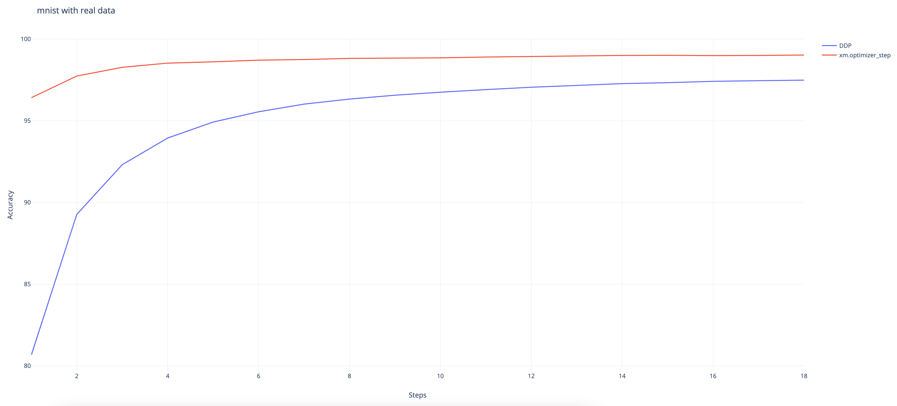

# How to do DistributedDataParallel(DDP)

This document shows how to use torch.nn.parallel.DistributedDataParallel
in xla, and further describes its difference against the native xla data
parallel approach. You can find a minimum runnable example
[here](https://github.com/pytorch/xla/blob/master/examples/data_parallel/train_resnet_ddp.py).

## Background / Motivation

Customers have long requested the ability to use PyTorch's
DistributedDataParallel API with xla. And here we enable it as an
experimental feature.

## How to use DistributedDataParallel

For those who switched from the PyTorch eager mode to XLA, here are all
the changes you need to do to convert your eager DDP model into XLA
model. We assume that you already know how to use XLA [on a single
device](../API_GUIDE.md#running-on-a-single-xla-device).

1.  Import xla specific distributed packages:

    ``` python
    import torch_xla
    import torch_xla.runtime as xr
    import torch_xla.distributed.xla_backend
    ```

2.  Init xla process group similar to other process groups such as nccl
    and gloo.

    ``` python
    dist.init_process_group("xla", rank=rank, world_size=world_size)
    ```

3.  Use xla specific APIs to get rank and world_size if you need to.

    ``` python
    new_rank = xr.global_ordinal()
    world_size = xr.world_size()
    ```

4.  Wrap the model with DDP.

    ``` python
    ddp_model = DDP(model)
    ```

5.  Finally launch your model with xla specific launcher.

    ``` python
    torch_xla.launch(demo_fn)
    ```

Here we have put everything together (the example is actually taken from
the [DDP
tutorial](https://pytorch.org/tutorials/intermediate/ddp_tutorial.html)).
The way you code it is pretty similar to the eager experience. Just with
xla specific touches on a single device plus the above five changes to
your script.

``` python
import os
import sys
import tempfile
import torch
import torch.distributed as dist
import torch.nn as nn
import torch.optim as optim

from torch.nn.parallel import DistributedDataParallel as DDP

# additional imports for xla
import torch_xla
import torch_xla.core.xla_model as xm
import torch_xla.runtime as xr
import torch_xla.distributed.xla_backend

def setup(rank, world_size):
    os.environ['PJRT_DEVICE'] = 'TPU'

    # initialize the xla process group
    dist.init_process_group("xla", rank=rank, world_size=world_size)

def cleanup():
    dist.destroy_process_group()

class ToyModel(nn.Module):
    def __init__(self):
        super(ToyModel, self).__init__()
        self.net1 = nn.Linear(10, 1000000)
        self.relu = nn.ReLU()
        self.net2 = nn.Linear(1000000, 5)

    def forward(self, x):
        return self.net2(self.relu(self.net1(x)))

def demo_basic(rank):
    # xla specific APIs to get rank, world_size.
    new_rank = xr.global_ordinal()
    assert new_rank == rank
    world_size = xr.world_size()

    print(f"Running basic DDP example on rank {rank}.")
    setup(rank, world_size)

    # create model and move it to XLA device
    device = xm.xla_device()
    model = ToyModel().to(device)
    ddp_model = DDP(model)

    loss_fn = nn.MSELoss()
    optimizer = optim.SGD(ddp_model.parameters(), lr=0.001)

    optimizer.zero_grad()
    outputs = ddp_model(torch.randn(20, 10).to(device))
    labels = torch.randn(20, 5).to(device)
    loss_fn(outputs, labels).backward()
    optimizer.step()
    # xla specific API to execute the graph
    xm.mark_step()

    cleanup()


def run_demo(demo_fn):
    # xla specific launcher
    torch_xla.launch(demo_fn)

if __name__ == "__main__":
    run_demo(demo_basic)
```

## Benchmarking

### Resnet50 with fake data

The following results are collected with the command on a TPU VM V3-8
environment with ToT PyTorch and PyTorch/XLA:

``` bash
python test/test_train_mp_imagenet.py --fake_data --model=resnet50 --num_epochs=1
```

And the statistical metrics are produced by using the script in this
[pull request](https://github.com/pytorch/xla/pull/4107). The unit for
the rate is images per second.

<table>
    <tr>
        <th>Type</th>
        <th>Mean</th>
        <th>Median</th>
        <th>90th %</th>
        <th>Std deviation</th>
        <th>CV</th>
    </tr>
    <tr>
        <td>xm.optimizer_step</td>
        <td>418.54</td>
        <td>419.22</td>
        <td>430.40</td>
        <td>9.76</td>
        <td>0.02</td>
    </tr>
    <tr>
        <td>DDP</td>
        <td>395.97</td>
        <td>395.54</td>
        <td>407.13</td>
        <td>7.60</td>
        <td>0.02</td>
    </tr>
</table>

The performance difference between our native approach for distributed
data parallel and DistributedDataParallel wrapper is: 1 - 395.97 /
418.54 = 5.39%. This result seems reasonable given the DDP wrapper
introduces extra overheads on tracing the DDP runtime.

### MNIST with fake data

The following results are collected with the command:
`python test/test_train_mp_mnist.py --fake_data` on a TPU VM V3-8
environment with ToT PyTorch and PyTorch/XLA. And the statistical
metrics are produced by using the script in this [pull
request](https://github.com/pytorch/xla/pull/4107). The unit for the
rate is images per second.

<table>
    <tr>
        <th>Type</th>
        <th>Mean</th>
        <th>Median</th>
        <th>90th %</th>
        <th>Std Dev</th>
        <th>CV</th>
    </tr>
    <tr>
        <td>xm.optimizer_step</td>
        <td>17864.19</td>
        <td>20108.96</td>
        <td>24351.74</td>
        <td>5866.83</td>
        <td>0.33</td>
    </tr>
    <tr>
        <td>DDP</td>
        <td>10701.39</td>
        <td>11770.00</td>
        <td>14313.78</td>
        <td>3102.92</td>
        <td>0.29</td>
    </tr>
</table>

The performance difference between our native approach for distributed
data parallel and DistributedDataParallel wrapper is: 1 - 14313.78 /
24351.74 = 41.22%. Here we compare 90th % instead since the dataset is
small and first a few rounds are heavily impacted by data loading. This
slowdown is huge but makes sense given the model is small. The
additional DDP runtime tracing overhead is hard to amortize.

### MNIST with real data

The following results are collected with the command n a TPU VM V3-8
environment with ToT PyTorch and PyTorch/XLA:

``` bash
python test/test_train_mp_mnist.py --logdir mnist/ o.
```



And we can observe that the DDP wrapper converges slower than the native
XLA approach even though it still achieves a high accuracy rate at
97.48% at the end. (The native approach achieves 99%.)

## Disclaimer

This feature is still experimental and under active development. Use it
in cautions and feel free to file any bugs to the [xla github
repo](https://github.com/pytorch/xla/). For those who are interested in
the native xla data parallel approach, here is the
[tutorial](../API_GUIDE.md#running-on-multiple-xla-devices-with-multi-processing).

Here are some of the known issues that are under investigation: \*
`gradient_as_bucket_view=False` needs to be enforced. \* There are some
issues while being used with `torch.utils.data.DataLoader`.
`test_train_mp_mnist.py` with real data crashes before exiting.
