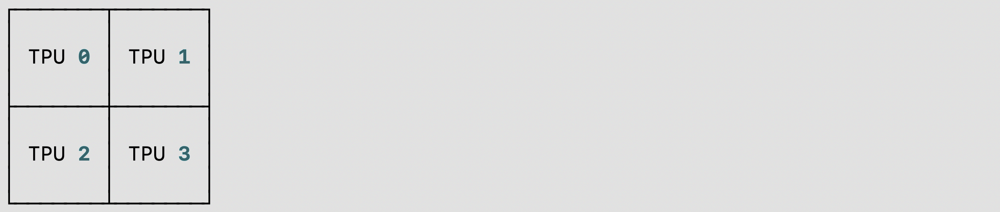
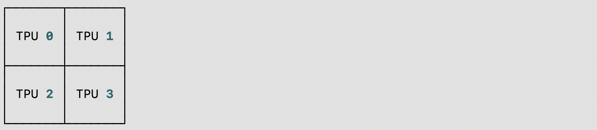

# SPMD advanced topics

This guide covers advanced topics with SPMD. Please read the
[SPMD user guide](https://github.com/pytorch/xla/blob/master/docs/spmd_basic.md) as a prerequisite.

### Sharding-Aware Host-to-Device Data Loading

SPMD takes a single-device program, shards it, and executes it in parallel.

SPMD execution does not work well with the native PyTorch DataLoader, which transfers data synchronously from the host to XLA devices. This blocks the training during the input data transfer every step.

To improve the native data loading performance, use PyTorch/XLA's ParallelLoader, which shards the directly when passed the optional kwarg _input\_sharding_:

```python
# MpDeviceLoader returns ParallelLoader.per_device_loader as iterator
train_loader = pl.MpDeviceLoader(
         train_loader,  # wraps PyTorch DataLoader
         device,
	 # assume 4d input and we want to shard at the batch dimension.
         input_sharding=xs.ShardingSpec(input_mesh, ('data', None, None, None)))
```

It is also possible to specify a different `input_sharding` for each element of the batch if they are different shapes:

```python
# if batch = next(train_loader) looks like
# {'x': <tensor of shape [s1, s2, s3, s4]>, 'y': <tensor for shape [s1, s2]>}

# MpDeviceLoader returns ParallelLoader.per_device_loader as iterator
train_loader = pl.MpDeviceLoader(
         train_loader,  # wraps PyTorch DataLoader
         device,
	 # specify different sharding for each input of the batch.
         input_sharding={
          'x': xs.ShardingSpec(input_mesh, ('data', None, None, None)),
          'y': xs.ShardingSpec(input_mesh, ('data', None))
        }
)
```

### Virtual device optimization

PyTorch/XLA normally transfers tensor data asynchronously from host to device once the tensor is defined. This is to overlap the data transfer with the graph tracing time. However, because SPMD allows the user to modify the tensor sharding _after _the tensor has been defined, we need an optimization to prevent unnecessary transfer of tensor data back and forth between host and device. We introduce Virtual Device Optimization, a technique to place the tensor data on a virtual device SPMD:0 first, before uploading to the physical devices when all the sharding decisions are finalized. Every tensor data in SPMD mode is placed on a virtual device, SPMD:0. The virtual device is exposed to the user as an XLA device XLA:0 with the actual shards on physical devices, like TPU:0, TPU:1, etc.


## Hybrid mesh

Mesh nicely abstracts how the physical device mesh is constructed. Users can arrange devices in any shape and order using the logical mesh. However, one can define a more performant mesh based on the physical topology, especially when it involves Data Center Network (DCN) cross slice connections. HybridMesh creates a mesh which gives good performance out of the box for such multislice environments. It accepts ici\_mesh\_shape and dcn\_mesh\_shape which denote logical mesh shapes of inner and outer network.

```python
from torch_xla.distributed.spmd import HybridMesh

# This example is assuming 2 slices of v4-8.
# - ici_mesh_shape: shape of the logical mesh for inner connected devices.
# - dcn_mesh_shape: shape of logical mesh for outer connected devices.
ici_mesh_shape = (1, 4, 1) # (data, fsdp, tensor)
dcn_mesh_shape = (2, 1, 1)

mesh = HybridMesh(ici_mesh_shape, dcn_mesh_shape, ('data','fsdp','tensor'))
print(mesh.shape())
>> OrderedDict([('data', 2), ('fsdp', 4), ('tensor', 1)])
```
### Running SPMD on TPU Pod

There is no code change required to go from single TPU host to TPU Pod if you construct your mesh and partition spec based on the number of devices instead of some hardcode constant. To run the PyTorch/XLA workload on TPU Pod, please refer to the [Pods section](https://github.com/pytorch/xla/blob/master/docs/pjrt.md#pods) of our PJRT guide.

### XLAShardedTensor

`xs.mark_sharding` is a inplace op that will attach the sharding annotation to the input tensor, but it also return a `XLAShardedTensor` python object.

The main use case for `XLAShardedTensor` [[RFC](https://github.com/pytorch/xla/issues/3871)] is to annotate a native `torch.tensor` (on a single device) with a sharding spec. The annotation takes place immediately, but the actual sharding of the tensor is delayed as the computation is carried out lazily, except for the input tensors which are sharded without delay. Once a tensor is annotated and wrapped inside a `XLAShardedTensor`, it can be passed to existing PyTorch ops and `nn.Module` layers as `torch.Tensor`. This is important to ensure that the same PyTorch layers and tensor ops can be stacked together with `XLAShardedTensor`. This means that the user does not need to rewrite the existing ops and model codes for sharded computation. Namely, `XLAShardedTensor` will satisfy the following requirements:


*   `XLAShardedTensor` is a `torch.Tensor` subclass and works directly with native torch ops and `module.layers`. We use `__torch_dispatch__` to send `XLAShardedTensor` to the XLA backend. PyTorch/XLA retrieves attached sharding annotations to trace the graph and invokes XLA SPMDPartitioner.
*   Internally, `XLAShardedTensor` (and its global\_tensor input) is backed by `XLATensor` with a special data structure holding references to the sharded device data.
*   The sharded tensor after lazy execution may be gathered and materialized back to the host as global\_tensor when requested on the host (e.g., printing the value of the global tensor.
*   The handles to the local shards are materialized strictly after the lazy execution. `XLAShardedTensor` exposes [local\_shards](https://github.com/pytorch/xla/blob/4e8e5511555073ce8b6d1a436bf808c9333dcac6/torch_xla/distributed/spmd/xla_sharded_tensor.py#L117) to return the local shards on addressable devices as <code>List[[XLAShard](https://github.com/pytorch/xla/blob/4e8e5511555073ce8b6d1a436bf808c9333dcac6/torch_xla/distributed/spmd/xla_sharded_tensor.py#L12)]</code>.

There is also an ongoing effort to integrate <code>XLAShardedTensor</code> into <code>DistributedTensor</code> API to support XLA backend [[RFC](https://github.com/pytorch/pytorch/issues/92909)].

### DTensor Integration
PyTorch has prototype-released [DTensor](https://github.com/pytorch/pytorch/blob/main/torch/distributed/tensor/README.md) since 2.1.
We are integrating PyTorch/XLA SPMD into DTensor API [RFC](https://github.com/pytorch/pytorch/issues/92909). We have a proof-of-concept integration for `distribute_tensor`, which calls `mark_sharding` annotation API to shard a tensor and its computation using XLA:
```python
import torch
from torch.distributed.tensor import init_device_mesh, Shard, distribute_tensor

# distribute_tensor now works with `xla` backend using PyTorch/XLA SPMD.
mesh = init_device_mesh("xla", mesh_shape=(world_size,))
big_tensor = torch.randn(100000, 88)
my_dtensor = distribute_tensor(big_tensor, mesh, [Shard(0)])
```

This feature is experimental and stay tuned for more updates, examples and tutorials in the upcoming releases.

### Activation Sharding for torch.compile

In the 2.3 release, PyTorch/XLA added the custom op `dynamo_mark_sharding` which can be used to perform the activation sharding in a `torch.compile` region. This is part of our ongoing effort to make `torch.compile` + `SPMD` to be the recommended way of doing the model inference using PyTorch/XLA. Example of using this custom op:
```
# Activation output sharding
device_ids = [i for i in range(self.num_devices)] # List[int]
mesh_shape = [self.num_devices//2, 1, 2] # List[int]
axis_names = "('data', 'model')" # string version of axis_names
partition_spec = "('data', 'model')" # string version of partition spec
torch.ops.xla.dynamo_mark_sharding(output, device_ids, mesh_shape, axis_names, partition_spec)
```

(spmd-debugging-tool)=

### SPMD Debugging Tool

We provide a `shard placement visualization debug tool` for PyTorch/XLA SPMD user on TPU/GPU/CPU with single-host/multi-host: you could use `visualize_tensor_sharding` to visualize sharded tensor, or you could use `visualize_sharding` to visualize sharing string. Here are two code examples on TPU single-host(v4-8) with `visualize_tensor_sharding` or `visualize_sharding`:
- Code snippet used `visualize_tensor_sharding` and visualization result:

```python
import rich

# Here, mesh is a 2x2 mesh with axes 'x' and 'y'
t = torch.randn(8, 4, device='xla')
xs.mark_sharding(t, mesh, ('x', 'y'))

# A tensor's sharding can be visualized using the `visualize_tensor_sharding` method
from torch_xla.distributed.spmd.debugging import visualize_tensor_sharding
generated_table = visualize_tensor_sharding(t, use_color=False)
```
<picture>
  <source media="(prefers-color-scheme: dark)" srcset="../_static/img/spmd_debug_1.png">
  
</picture>

- Code snippet used `visualize_sharding` and visualization result:

```python
from torch_xla.distributed.spmd.debugging import visualize_sharding
sharding = '{devices=[2,2]0,1,2,3}'
generated_table = visualize_sharding(sharding, use_color=False)
```
<picture>
  <source media="(prefers-color-scheme: dark)" srcset="../_static/img/spmd_debug_2.png">
  
</picture>

You could use these examples on TPU/GPU/CPU single-host and modify it to run on multi-host. And you could modify it to sharding-style `tiled`, `partial_replication` and `replicated`.

### Auto-Sharding
We are introducing a new PyTorch/XLA SPMD feature, called ``auto-sharding``, [RFC](https://github.com/pytorch/xla/issues/6322). This is an experimental feature in `r2.3` and `nightly`, that supports `XLA:TPU` and a single TPUVM host.

PyTorch/XLA auto-sharding can be enabled by one of the following:
- Setting envvar `XLA_AUTO_SPMD=1`
- Calling the SPMD API in the beginning of your code:

```python
import torch_xla.runtime as xr
xr.use_spmd(auto=True)
```
- Calling `pytorch.distributed.tensor.distribute_module` with `auto-policy` and `xla`:

```python
import torch_xla.runtime as xr
from torch.distributed.tensor import init_device_mesh, distribute_module
from torch_xla.distributed.spmd import auto_policy

device_count = xr.global_runtime_device_count()
device_mesh = init_device_mesh("xla", mesh_shape=(device_count,))

# Currently, model should be loaded to xla device via distribute_module.
model = MyModule()  # nn.module
sharded_model = distribute_module(model, device_mesh, auto_policy)
```

Optionally, one can set the following options/env-vars to control the behvaior of
the XLA-based auto-sharding pass:
- `XLA_AUTO_USE_GROUP_SHARDING`: group resharding of the parameters. Set by default.
- `XLA_AUTO_SPMD_MESH`: logical mesh shape to be used for auto-sharding. For example,
`XLA_AUTO_SPMD_MESH=2,2` corresponds to a 2-by-2 mesh with 4 global devices. If unset,
a default device mesh shape of `num_devices,1` will be used.

