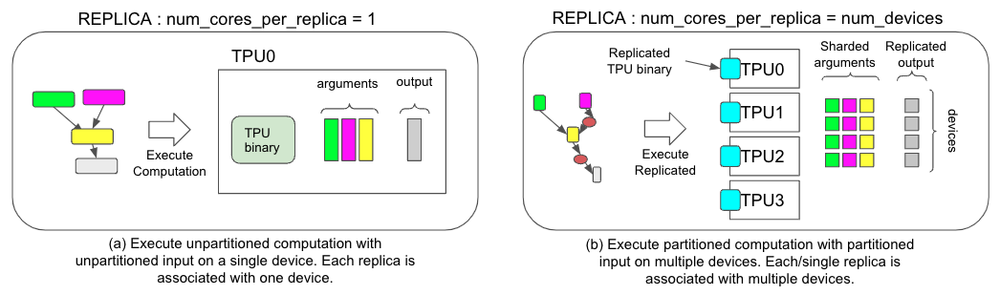

# SPMD User Guide

In this user guide, you will learn how
[SPMD](https://arxiv.org/abs/2105.04663) is integrated in PyTorch/XLA.

For a conceptual guide of the SPMD model of computation, refer to the
[Sharded Matrices and How to Multiply Them](https://jax-ml.github.io/scaling-book/sharding/)
section of the _How to Scale Your Model_ book.

## What is PyTorch/XLA SPMD?

[SPMD](https://arxiv.org/abs/2105.04663) is an automatic
parallelization system for common ML workloads. The XLA compiler will
transform the single device program into a partitioned one with proper
collectives, based on the user provided sharding hints. This feature
allows developers to write PyTorch programs as if they are on a single
large device without any custom sharded computation ops and/or
collective communications to scale.


_<span style="text-decoration:underline;">Figure 1. Comparison of two different execution strategies, (a) for non-SPMD and (b) for SPMD.</span>_

## How to use PyTorch/XLA SPMD?

Here is an example of using SPMD

```python
import numpy as np
import torch
import torch_xla.core.xla_model as xm
import torch_xla.runtime as xr
import torch_xla.distributed.spmd as xs
from torch_xla.distributed.spmd import Mesh

# Enable XLA SPMD execution mode.
xr.use_spmd()

# Device mesh, this and partition spec as well as the input tensor shape define the individual shard shape.
num_devices = xr.global_runtime_device_count()
mesh_shape = (num_devices, 1)
device_ids = np.array(range(num_devices))
mesh = Mesh(device_ids, mesh_shape, ('data', 'model'))

t = torch.randn(8, 4).to(xm.xla_device())

# Mesh partitioning, each device holds 1/8-th of the input
partition_spec = ('data', 'model')
xs.mark_sharding(t, mesh, partition_spec)
```

### SPMD Mode

In order to use SPMD, you need to enable it via `xr.use_spmd()`. In SPMD
mode there is only one logical device. Distributed computation and
collective is handled by the `mark_sharding`. Note that you can not mix
SPMD with other distributed libraries.

### Mesh

The SPMD programming model is built around the concept of a device mesh.
A device mesh is a logical N-dimensional
arrangement of compute devices (e.g. TPU cores) where MPI-style collective
operations may be requested for devices along an axis. The device mesh shape
shape does not necessarily reflect the physical network layout. You
can create different device mesh shapes over the same set of physical
devices. For example, a 512-core TPU slice can be treated as a 3D mesh of
16×16×2, a 2D mesh of 32×16, or a 1D mesh of 512, depending on how you want to
partition tensors. Use the `Mesh` class to create a device mesh.

In the following snippet:

```python
mesh_shape = (num_devices, 1)
device_ids = np.array(range(num_devices))
mesh = Mesh(device_ids, mesh_shape, ('data', 'model'))
```

- `mesh_shape` is a tuple whose elements describe the size of each axis of the
  device mesh. When you multiply the elements of the tuple together, it should
  equal to the total number of physical devices in the environment.
- `device_ids` specifies the ordering of physical devices within the mesh in row
  major order. It is always a flat numpy array of integers ranging from `0` to
  `num_devices - 1`, where `num_devices` is the total number of devices in the
  environment. Each ID indexes into the list of devices in
  `xr.global_runtime_device_attributes()`.
  The simplest ordering is `np.array(range(num_devices))`, but tuning the
  device ordering and the mesh shape to utilize the underlying physical
  interconnect can improve efficiency.
- Best practice is to give each mesh axis a name. You can then shard each
  dimension of tensors over specific mesh axes to achieve the desired
  parallelization. In the previous example, the first mesh dimension is the
  `data` dimension and the second mesh dimension is the `model` dimension.

Retrieve more mesh info via:

```python
    >>> mesh.shape()
    OrderedDict([('data', 4), ('model', 1)])

    >>> mesh.get_logical_mesh()
    array([[0], [1], [2], [3]])

    # Details about these 4 TPUs
    >>> xr.global_runtime_device_attributes()
    [{'core_on_chip': 0, 'num_cores': 1, 'coords': [0, 0, 0], 'name': 'TPU:0'},
     {'core_on_chip': 0, 'num_cores': 1, 'coords': [1, 0, 0], 'name': 'TPU:1'},
     {'core_on_chip': 0, 'num_cores': 1, 'coords': [0, 1, 0], 'name': 'TPU:2'},
     {'core_on_chip': 0, 'num_cores': 1, 'coords': [1, 1, 0], 'name': 'TPU:3'}]
```

If your workload is run on [multiple TPU slices][multislice] simultaneously, the
device attributes will include a `slice_index` indicating the containing slice:

``` python
    # Details about 8 TPUs allocated over 2 slices
    >>> xr.global_runtime_device_attributes()
    [{'num_cores': 1, 'core_on_chip': 0, 'slice_index': 0, 'coords': [0, 0, 0], 'name': 'TPU:0'},
     {'num_cores': 1, 'core_on_chip': 0, 'slice_index': 0, 'coords': [1, 0, 0], 'name': 'TPU:1'},
     {'num_cores': 1, 'core_on_chip': 0, 'slice_index': 0, 'coords': [0, 1, 0], 'name': 'TPU:2'},
     {'num_cores': 1, 'core_on_chip': 0, 'slice_index': 0, 'coords': [1, 1, 0], 'name': 'TPU:3'},
     {'num_cores': 1, 'core_on_chip': 0, 'slice_index': 1, 'coords': [0, 0, 0], 'name': 'TPU:4'},
     {'num_cores': 1, 'core_on_chip': 0, 'slice_index': 1, 'coords': [1, 0, 0], 'name': 'TPU:5'},
     {'num_cores': 1, 'core_on_chip': 0, 'slice_index': 1, 'coords': [0, 1, 0], 'name': 'TPU:6'},
     {'num_cores': 1, 'core_on_chip': 0, 'slice_index': 1, 'coords': [1, 1, 0], 'name': 'TPU:7'}]
```

In this example, a device ID of `7` will refer to the TPU at coordinate
`[1, 1, 0]` in the second slice.

### Partition spec

In the following snippet:

```python
partition_spec = ('data', 'model')
xs.mark_sharding(t, mesh, partition_spec)
```

`partition_spec` has the same rank as the input tensor. Each dimension
describes how the corresponding input tensor dimension is sharded across
the device mesh. In the above example, the first dimension of tensor `t` is
sharded over the `data` dimension and the second dimension is sharded over the
`model` dimension.

User can also shard tensor that has a different rank from the mesh shape.

```python
t1 = torch.randn(8, 8, 16).to(device)
t2 = torch.randn(8).to(device)

# First dimension is being replicated.
xs.mark_sharding(t1, mesh, (None, 'data', 'model'))

# First dimension is being sharded at data dimension.
# model dimension is used for replication when omitted.
xs.mark_sharding(t2, mesh, ('data',))

# First dimension is sharded across both mesh axes.
xs.mark_sharding(t2, mesh, (('data', 'model'),))
```

### Which device holds which shard?

Each dimension of a tensor passed to `mark_sharding` will be split over the
devices identified by the corresponding element in the partition spec. For
example, given a `[M, N]` shaped tensor `t`, a mesh of shape `[X, Y]`, and a
partition spec of `('X', 'Y')`, the first dimension of the tensor will be sharded
`X`-ways, and the second dimension will be sharded `Y`-ways. The device
identified by `device_ids[i]` will hold a subset of data that is
`t[a * M / X : (a + 1) * M / X, b * N / Y : (b + 1) * N / Y]`, where `a = i // Y`
and `b = i % Y`.

This assumes that `M` and `N` are divisible by `X` and `Y`, respectively. If not,
the last device may hold some padding.

You can also visualize how a tensor is sharded over devices with our
SPMD debugging tool at {ref}`spmd-debugging-tool`.

## Further Reading

1.  [Example](https://github.com/pytorch/xla/blob/master/examples/data_parallel/train_resnet_spmd_data_parallel.py)
    to use SPMD to express data parallelism.
1.  [Example](https://github.com/pytorch/xla/blob/master/examples/fsdp/train_decoder_only_fsdp_v2.py)
    to use SPMD to express FSDP(Fully Sharded Data Parallel).
1.  [SPMD advanced topics](./spmd_advanced.md)
1.  [Spmd Distributed Checkpoint](./spmd_distributed_checkpoint.md)
1.  [multislice]: https://cloud.google.com/tpu/docs/multislice-introduction
1.  [debug-tool]: ./spmd_advanced.md#spmd-debugging-tool
