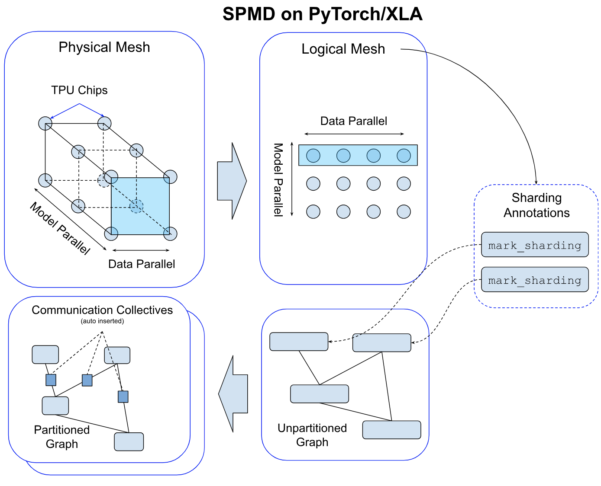
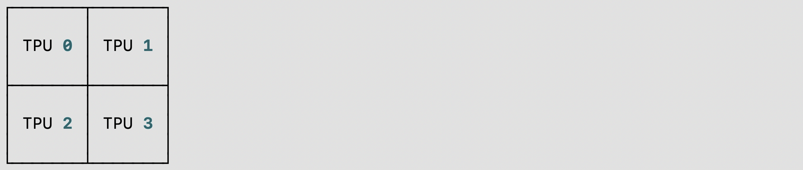

# PyTorch/XLA SPMD User Guide

In this user guide, we discuss how [GSPMD](https://arxiv.org/abs/2105.04663) is integrated in PyTorch/XLA, and provide a design overview to illustrate how the SPMD sharding annotation API and its constructs work. And then, we provide a list of reference examples for users to try.


## What is PyTorch/XLA SPMD?

[GSPMD](https://arxiv.org/abs/2105.04663) is an automatic parallelization system for common ML workloads. The XLA compiler will transform the single device program into a partitioned one with proper collectives, based on the user provided sharding hints. This feature allows developers to write PyTorch programs as if they are on a single large device without any custom sharded computation ops and/or collective communications to scale.


_<span style="text-decoration:underline;">Figure 1. Comparison of two different execution strategies, (a) for non-SPMD and (b) for SPMD.</span>_

To support GSPMD in PyTorch/XLA, we are introducing a new execution mode. Before GSPMD, the execution mode in PyTorch/XLA assumed multiple model replicas, each with a single core (Figure 1.a). This mode of execution, as illustrated in the above  suits data parallelism frameworks, like the popular PyTorch [Distributed Data Parallel (DDP)](https://pytorch.org/tutorials/intermediate/ddp_tutorial.html) or Fully Sharded Data Parallel (FSDP), but is also limited in that a replica can only reside on one device core for execution. PyTorch/XLA SPMD introduces a new execution mode that assumes a single replica with multiple cores (Figure 1.b), allowing a replica to run across multiple device cores. This shift unlocks more advanced parallelism strategies for better large model training performance.

PyTorch/XLA SPMD is available on the new [PJRT](https://github.com/pytorch/xla/blob/master/docs/pjrt.md) runtime. To enable PyTorch/XLA SPMD execution mode, the user must call <code>[use_spmd() API](https://github.com/pytorch/xla/blob/b8b484515a97f74e013dcf38125c44d53a41f011/torch_xla/runtime.py#L214)</code>.

```python
import torch_xla.runtime as xr

# Enable PyTorch/XLA SPMD execution mode.
xr.use_spmd()
assert xr.is_spmd() == True
```

It is important to note that SPMD is a replacement for any existing parallel mechanisms, including DDP and FSDP. Users can not mix two different execution modes (SPMD and non-SPMD), and later in this guide we will go over how to use SPMD annotation to perform DDP and FSDP.

Also, this version of the SPMD is currently only tested.optimized on Google Cloud TPU. GPU support and optimization will come in the 2.2 release.


## PyTorch/XLA SPMD Design Overview


### Simple Example & Sharding Aannotation API

Users can annotate native PyTorch tensors using the `mark_sharding` API ([src](https://github.com/pytorch/xla/blob/4e8e5511555073ce8b6d1a436bf808c9333dcac6/torch_xla/distributed/spmd/xla_sharding.py#L452)). This takes `torch.Tensor` as input and returns a `XLAShardedTensor` as output.

```python
def mark_sharding(t: Union[torch.Tensor, XLAShardedTensor], mesh: Mesh, partition_spec: Tuple[Union[int, None]]) -> XLAShardedTensor
```

Invoking `mark_sharding` API takes a user defined logical [mesh](#mesh) and [partition\_spec](#partition-spec) and generates a sharding annotation for the XLA compiler. The sharding spec is attached to the XLATensor. Here is a simple usage example from the [[RFC](https://github.com/pytorch/xla/issues/3871), to illustrate how the sharding annotation API works:

```python
import numpy as np
import torch
import torch_xla.core.xla_model as xm
import torch_xla.runtime as xr
import torch_xla.distributed.spmd as xs
from torch_xla.distributed.spmd import Mesh

# Enable XLA SPMD execution mode.
xr.use_spmd()

# Device mesh, this and partition spec as well as the input tensor shape define the individual shard shape.
mesh_shape = (2, 4)
num_devices = xr.global_runtime_device_count()
device_ids = np.array(range(num_devices))
mesh = Mesh(device_ids, mesh_shape, ('x', 'y'))

t = torch.randn(8, 4).to(xm.xla_device())

# Mesh partitioning, each device holds 1/8-th of the input
partition_spec = (0, 1)
m1_sharded = xs.mark_sharding(t, mesh, partition_spec)
assert isinstance(m1_sharded, XLAShardedTensor) == True
```

We can annotate different tensors in the PyTorch program to enable different parallelism techniques, as described in the comment below:

```python
# Sharding annotate the linear layer weights.
model = SimpleLinear().to(xm.xla_device())
xs.mark_sharding(model.fc1.weight, mesh, partition_spec)

# Training loop
model.train()
for step, (data, target) in enumerate(loader):
  # Assumes `loader` returns data, target on XLA device
  optimizer.zero_grad()
  # Sharding annotate input data, we can shard any input
  # dimensions. Sharidng the batch dimension enables
  # in data parallelism, sharding the feature dimension enables
  # spatial partitioning.
  xs.mark_sharding(data, mesh, partition_spec)
  ouput = model(data)
  loss = loss_fn(output, target)
  optimizer.step()
  xm.mark_step()
```

More complete unit test cases and integration test examples are available in the PyTorch/XLA [repo](https://github.com/pytorch/xla/tree/r2.0/test/spmd).


### Mesh

For a given cluster of devices, a physical mesh is a representation of the interconnect topology.

We derive a logical mesh based on this topology to create sub-groups of devices which can be used for partitioning different axes of tensors in a model.



We abstract logical mesh with [Mesh API](https://github.com/pytorch/xla/blob/4e8e5511555073ce8b6d1a436bf808c9333dcac6/torch_xla/distributed/spmd/xla_sharding.py#L17). The axes of the logical Mesh can be named. Here is an example:

```python
import torch_xla.runtime as xr
from torch_xla.distributed.spmd import Mesh

# Assuming you are running on a TPU host that has 8 devices attached
num_devices = xr.global_runtime_device_count()
# mesh shape will be (4,2) in this example
mesh_shape = (num_devices // 2, 2)
device_ids = np.array(range(num_devices))
# axis_names 'x' nad 'y' are optional
mesh = Mesh(device_ids, mesh_shape, ('x', 'y'))

mesh.get_logical_mesh()
>> array([[0, 1],
          [2, 3],
          [4, 5],
          [6, 7]])
mesh.shape()
>> OrderedDict([('x', 4), ('y', 2)])
```

In general, SPMD programs should create a single mesh and reuse it for all sharding to ensure that the tiling assignment is consistent with the intended sharding strategy. The same mesh can be reused for tensors of different shapes and shardings by manipulating the partition spec, described further below.

### Hybrid Mesh

Mesh nicely abstracts how the physical device mesh is constructed. Users can arrange devices in any shape and order using the logical mesh. However, one can define a more performant mesh based on the physical topology, especially when it involves Data Center Network (DCN) cross slice connections. HybridMesh creates a mesh which gives good performance out of the box for such multislice environments. It accepts ici\_mesh\_shape and dcn\_mesh\_shape which denote logical mesh shapes of inner and outer network.

```python
from torch_xla.distributed.spmd import HybridMesh

# This example is assuming 2 slices of v4-8.
# - ici_mesh_shape: shape of the logical mesh for inner connected devices.
# - dcn_mesh_shape: shape of logical mesh for outer connected devices.
ici_mesh_shape = (1, 4, 1) # (data, fsdp, tensor)
dcn_mesh_shape = (2, 1, 1)

mesh = HybridMesh(ici_mesh_shape, dcn_mesh_shape, ('data','fsdp','tensor'))
print(mesh.shape())
>> OrderedDict([('data', 2), ('fsdp', 4), ('tensor', 1)])
```


### Partition Spec

partition\_spec has the same rank as the input tensor. Each dimension describes how the corresponding input tensor dimension is sharded across the device mesh (logically defined by mesh\_shape). `partition_spec` is a tuple of `device_mesh` dimension `index` or None. The index can be an `int` or `str`, if the corresponding mesh dimension is named. This specifies how each input rank is sharded (`index` to `mesh_shape`) or replicated (`None`).

```python
# Provide optional mesh axis names and use them in the partition spec
mesh = Mesh(device_ids, (4, 2), ('data', 'model'))
partition_spec = ('model', 'data')
xs.mark_sharding(input_tensor, mesh, partition_spec)
```

We support all three types of sharding, described in the original [GSPMD](https://arxiv.org/abs/2105.04663) paper. For instance, one can specify partial replication like this:

```python
# Provide optional mesh axis names and use them in the partition spec
mesh = Mesh(device_ids, (2, 2, 2), ('x', 'y', 'z'))

# evenly shard across x and z and replicate among y
partition_spec = ('x', 'z')  # equivalent to ('x', None, 'z')
xs.mark_sharding(input_tensor, mesh, partition_spec)
```

The partition spec enables reuse of the same mesh for different tensor shapes and desired sharding strategies. The following example demonstrates this using a 3D mesh:

```python
# Create a 3-D mesh of 8 devices with logical dimensions replica, fsdp, and
# tensor
mesh = Mesh(device_ids, (2, 2, 2), ('replica', 'fsdp', 'tensor'))

# A 2D tensor can be sharded along the fsdp and tensor axes and replicated
# along the replica axis by omitting `replica` from the partition spec.
two_d_partially_replicated = torch.randn(64, 64, device='xla')
xs.mark_sharding(two_d_partially_replicated, mesh, ('fsdp', 'tensor'))

# A 2D tensor can be sharded across all dimensions by combining, for example,
# the replica and fsdp mesh axes using a tuple
two_d_fully_sharded = torch.randn(64, 64, device='xla')
xs.mark_sharding(two_d_fully_sharded, mesh, (('replica', 'fsdp'), 'tensor'))

# A 4D tensor can be sharded along up to three of its axes using the 3D mesh
four_d = torch.randn(64, 64, 64, 64, device='xla')
xs.mark_sharding(four_d, ('replica', 'fsdp', None, 'tensor'))
```


### XLAShardedTensor

The main use case for `XLAShardedTensor` [[RFC](https://github.com/pytorch/xla/issues/3871)] is to annotate a native `torch.tensor` (on a single device) with a sharding spec. The annotation takes place immediately, but the actual sharding of the tensor is delayed as the computation is carried out lazily, except for the input tensors which are sharded without delay. Once a tensor is annotated and wrapped inside a `XLAShardedTensor`, it can be passed to existing PyTorch ops and `nn.Module` layers as `torch.Tensor`. This is important to ensure that the same PyTorch layers and tensor ops can be stacked together with `XLAShardedTensor`. This means that the user does not need to rewrite the existing ops and model codes for sharded computation. Namely, `XLAShardedTensor` will satisfy the following requirements:


*   `XLAShardedTensor` is a `torch.Tensor` subclass and works directly with native torch ops and `module.layers`. We use `__torch_dispatch__` to send `XLAShardedTensor` to the XLA backend. PyTorch/XLA retrieves attached sharding annotations to trace the graph and invokes XLA SPMDPartitioner.
*   Internally, `XLAShardedTensor` (and its global\_tensor input) is backed by `XLATensor` with a special data structure holding references to the sharded device data.
*   The sharded tensor after lazy execution may be gathered and materialized back to the host as global\_tensor when requested on the host (e.g., printing the value of the global tensor.
*   The handles to the local shards are materialized strictly after the lazy execution. `XLAShardedTensor` exposes [local\_shards](https://github.com/pytorch/xla/blob/4e8e5511555073ce8b6d1a436bf808c9333dcac6/torch_xla/distributed/spmd/xla_sharded_tensor.py#L117) to return the local shards on addressable devices as <code>List[[XLAShard](https://github.com/pytorch/xla/blob/4e8e5511555073ce8b6d1a436bf808c9333dcac6/torch_xla/distributed/spmd/xla_sharded_tensor.py#L12)]</code>.

There is also an ongoing effort to integrate <code>XLAShardedTensor</code> into <code>DistributedTensor</code> API to support XLA backend [[RFC](https://github.com/pytorch/pytorch/issues/92909)].

### DTensor Integration
PyTorch has prototype-released [DTensor](https://github.com/pytorch/pytorch/blob/main/torch/distributed/_tensor/README.md) in 2.1.
We are integrating PyTorch/XLA SPMD into DTensor API [RFC](https://github.com/pytorch/pytorch/issues/92909). We have a proof-of-concept integration for `distribute_tensor`, which calls `mark_sharding` annotation API to shard a tensor and its computation using XLA:
```python
import torch
from torch.distributed import DeviceMesh, Shard, distribute_tensor

# distribute_tensor now works with `xla` backend using PyTorch/XLA SPMD.
mesh = DeviceMesh("xla", list(range(world_size)))
big_tensor = torch.randn(100000, 88)
my_dtensor = distribute_tensor(big_tensor, mesh, [Shard(0)])
```

This feature is experimental and stay tuned for more updates, examples and tutorials in the upcoming releases.

### Sharding-Aware Host-to-Device Data Loading

PyTorch/XLA SPMD takes a single-device program, shards and executes it in parallel. The SPMD execution requires using the native PyTorch DataLoader, which transfers data synchronously from the host to XLA devices. This blocks the training during the input data transfer every step. To improve the native data loading performance, we made PyTorch/XLA ParallelLoader support input sharding directly (src), when passed the optional kwarg _input\_sharding_:

```python
# MpDeviceLoader returns ParallelLoader.per_device_loader as iterator
train_loader = pl.MpDeviceLoader(
         train_loader,  # wraps PyTorch DataLoader
         device,
	  # optional input_sharding field
         input_sharding=xs.ShardingSpec(input_mesh, (0, 1, 2, 3)))
```


### Distributed Checkpointing

PyTorch/XLA SPMD is compatible with the [torch.distributed.checkpoint](https://pytorch.org/docs/stable/distributed.checkpoint.html) library through a dedicated `Planner` instance. Users are able to synchronously save and load checkpoints through this common interface.

The SPMDSavePlanner and SPMDLoadPlanner ([src](https://github.com/pytorch/xla/blob/master/torch_xla/experimental/distributed_checkpoint.py)) classes enable the `save` and `load` functions to operate directly on the shards of an `XLAShardedTensor`, enabling all of the benefits of distributed checkpointing in SPMD training.

Here is a demonstration of the synchronous distributed checkpointing API:

```python
import torch.distributed.checkpoint as dist_cp
import torch_xla.experimental.distributed_checkpoint as xc

# Saving a state_dict
state_dict = {
    "model": model.state_dict(),
    "optim": optim.state_dict(),
}

dist_cp.save(
    state_dict=state_dict,
    storage_writer=dist_cp.FileSystemWriter(CHECKPOINT_DIR),
    planner=xc.SPMDSavePlanner(),
)
...

# Loading the model's state_dict from the checkpoint. The model should
# already be on the XLA device and have the desired sharding applied.
state_dict = {
    "model": model.state_dict(),
}

dist_cp.load(
    state_dict=state_dict,
    storage_reader=dist_cp.FileSystemReader(CHECKPOINT_DIR),
    planner=xc.SPMDLoadPlanner(),
)
model.load_state_dict(state_dict["model"])
```

#### CheckpointManager

The experimental [CheckpointManager](https://github.com/pytorch/xla/blob/master/torch_xla/experimental/distributed_checkpoint/manager.py#L40)
interface provides a higher-level API over the `torch.distributed.checkpoint`
functions to enable a few key features:

- **Managed checkpoints**: Each checkpoint taken by the `CheckpointManager` is
identified by the step at which it was taken. All steps tracked are accessible
through the `CheckpointManager.all_steps` method, and any tracked steps can be
restored using `CheckpointManager.restore`.
- **Asynchronous checkpointing**: Checkpoints taken through the
`CheckpointManager.save_async` API are written to persistent storage
asynchronously to unblock training for the duration of the checkpoint. The
input sharded state_dict is first moved to CPU before the checkpoint is
dispatched to a background thread.
- **Auto-checkpointing on preemption**: On Cloud TPU, preemptions can be detected
and a checkpoint taken before the process is terminated. To use, ensure your
TPU is provisioned through a QueuedResource with
[Autocheckpointing enabled](https://cloud.google.com/sdk/gcloud/reference/alpha/compute/tpus/queued-resources/create#--autocheckpoint-enabled),
and ensure the `chkpt_on_preemption` parameter is set when constructing the
CheckpointManager (this option is enabled by default).
- **FSSpec Support**: `CheckpointManager` uses an fsspec storage backend to enable
checkpointing directly to any fsspec-compatible filesystem, including GCS.

Example usage of the CheckpointManager is below:

```python
from torch_xla.experimental.distributed_checkpoint import CheckpointManager, prime_optimizer

# Create a CheckpointManager to checkpoint every 10 steps into GCS.
chkpt_mgr = CheckpointManager('gs://my-bucket/my-experiment', 10)

# Select a checkpoint to restore from, and restore if applicable
tracked_steps = chkpt_mgr.all_steps()
if tracked_steps:
    # Choose the highest step
    best_step = max(tracked_steps)
    # Before restoring the checkpoint, the optimizer state must be primed
    # to allow state to be loaded into it.
    prime_optimizer(optim)
    state_dict = {'model': model.state_dict(), 'optim': optim.state_dict()}
    chkpt_mgr.restore(best_step, state_dict)
    model.load_state_dict(state_dict['model'])
    optim.load_state_dict(state_dict['optim'])

# Call `save` or `save_async` every step within the train loop. These methods
# return True when a checkpoint is taken.
for step, data in enumerate(dataloader):
    ...
    state_dict = {'model': model.state_dict(), 'optim': optim.state_dict()}
    if chkpt_mgr.save_async(step, state_dict):
        print(f'Checkpoint taken at step {step}')
```

##### Restoring Optimizer State

In distributed checkpointing, the state_dicts are loaded in-place, and only the
required shards of the checkpoint are loaded. Since optimizer states are lazily
created, the state isn't present until the first `optimizer.step` call, and
attempts to load an unprimed optimizer will fail.

The utility method `prime_optimizer` is provided for this: it runs a fake train
step by setting all gradients to zero and calling `optimizer.step`. *This is a
destructive method and will touch both model parameters and optimizer state*,
so it should only be called just prior to restoration.

### Process Groups
To use `torch.distributed` APIs such as distributed checkpointing, a process
group is required. In SPMD mode, the `xla` backend is not supported since the
compiler is responsible for all collectives.

Instead, a CPU process group such as `gloo` must be used. On TPUs, the `xla://`
init_method is still supported to discover the master IP, global world size,
and host rank. An example initialization is below:

```python
import torch.distributed as dist
# Import to register the `xla://` init_method
import torch_xla.distributed.xla_backend
import torch_xla.runtime as xr

xr.use_spmd()

# The `xla://` init_method will automatically discover master worker IP, rank,
# and global world size without requiring environment configuration on TPUs.
dist.init_process_group('gloo', init_method='xla://')
```

### Virtual Device Optimization

PyTorch/XLA normally transfers tensor data asynchronously from host to device once the tensor is defined. This is to overlap the data transfer with the graph tracing time. However, because GSPMD allows the user to modify the tensor sharding _after _the tensor has been defined, we need an optimization to prevent unnecessary transfer of tensor data back and forth between host and device. We introduce Virtual Device Optimization, a technique to place the tensor data on a virtual device SPMD:0 first, before uploading to the physical devices when all the sharding decisions are finalized. Every tensor data in SPMD mode is placed on a virtual device, SPMD:0. The virtual device is exposed to the user as an XLA device XLA:0 with the actual shards on physical devices, like TPU:0, TPU:1, etc.


### Number of processes

Unlike existing DDP and FSDP, under the SPMD mode, there is always a single process running on each accelerator host. This provides the benefit that PyTorch/XLA only need to compile each graph once which can be reused for all accelerators attached to this host.


### Running SPMD on TPU Pod

There is no code change required to go from single TPU host to TPU Pod if you construct your mesh and partition spec based on the number of devices instead of some hardcode constant. To run the PyTorch/XLA workload on TPU Pod, please refer to the [Pods section](https://github.com/pytorch/xla/blob/master/docs/pjrt.md#pods) of our PJRT guide.


### Running SPMD on GPU

PyTorch/XLA supports SPMD on NVIDIA GPU (single-node or multi-nodes). The training/inference script remains the same as the one used for TPU, such as this [ResNet script](https://github.com/pytorch/xla/blob/1dc78948c0c9d018d8d0d2b4cce912552ab27083/test/spmd/test_train_spmd_imagenet.py). To execute the script using SPMD, we leverage `torchrun`:

```
PJRT_DEVICE=CUDA \
torchrun \
--nnodes=${NUM_GPU_MACHINES} \
--node_rank=${RANK_OF_CURRENT_MACHINE} \
--nproc_per_node=1 \
--rdzv_endpoint="<MACHINE_0_IP_ADDRESS>:<PORT>" \
training_or_inference_script_using_spmd.py
```
- `--nnodes`: how many GPU machines to be used.
- `--node_rank`: the index of the current GPU machines. The value can be 0, 1, ..., ${NUMBER_GPU_VM}-1.
- `--nproc_per_node`: the value must be 1 due to the SPMD requirement.
- `--rdzv_endpoint`: the endpoint of the GPU machine with node_rank==0, in the form `host:port`. The host will be the internal IP address. The `port` can be any available port on the machine. For single-node training/inference, this parameter can be omitted.

For example, if you want to train a ResNet model on 2 GPU machines using SPMD, you can run the script below on the first machine:
```
XLA_USE_SPMD=1 PJRT_DEVICE=CUDA \
torchrun \
--nnodes=2 \
--node_rank=0 \
--nproc_per_node=1 \
--rdzv_endpoint="<MACHINE_0_INTERNAL_IP_ADDRESS>:12355" \
pytorch/xla/test/spmd/test_train_spmd_imagenet.py --fake_data --batch_size 128
```
and run the following on the second machine:
```
XLA_USE_SPMD=1 PJRT_DEVICE=CUDA \
torchrun \
--nnodes=2 \
--node_rank=1 \
--nproc_per_node=1 \
--rdzv_endpoint="<MACHINE_0_INTERNAL_IP_ADDRESS>:12355" \
pytorch/xla/test/spmd/test_train_spmd_imagenet.py --fake_data --batch_size 128
```

For more information, please refer to the [SPMD support on GPU RFC](https://github.com/pytorch/xla/issues/6256).


## Reference Examples


### Use SPMD to express Data Parallel

The SPMD API is general enough to express both data parallelism and model parallelism.  One can implement data parallelism simply by annotating the input batch dimension for sharding. Here, we have shard the batch dimension across all available devices (N-way):There are 2 ways of using SPMD to express data parallel or batch sharding:

```python
num_devices = xr.global_runtime_device_count()

# Assume data is 4d and 0th dimension is the batch dimension
mesh_shape = (num_devices,)
input_mesh = xs.Mesh(device_ids, mesh_shape, ('Data'))
partition_spec = ('data', None, None, None)

# Shard the input's batch dimension along the `data` axis, no sharding along other dimensions
xs.mark_sharding(input_tensor, input_mesh, partition_spec)
```

PyTorch/XLA’s MpDeviceLoader supports input batch sharding, which also loads the batches to the devices in the background:

```python
num_devices = xr.global_runtime_device_count()

# Assume data is 4d and 0th dimension is the batch dimension
mesh_shape = (num_devices)
input_mesh = xs.Mesh(device_ids, mesh_shape, ('Data'))
partition_spec = ('data', None, None, None)

# Use MpDeviceLoader to load data in background
train_loader = pl.MpDeviceLoader(
     train_loader,
     device,
     input_sharding=xs.ShardingSpec(input_mesh, partition_spec))
```

We highly recommend the second approach as it should yield a better training performance.


### Use SPMD to express FSDP(Fully Sharded Data Parallel)

PyTorch’s FSDP is data parallel + sharded model parameters at 0th dimension. Users first need to use SPMD to express Data Parallels as suggested in the previous section.

```python
for name, param in model.named_parameters():
    shape = (num_devices,)
    mesh = xs.Mesh(device_ids, shape, ('fsdp'))
    partition_spec = [None] * len(param.shape)
    partition_spec[0] = 'fsdp'
    xs.mark_sharding(param, mesh, partition_spec)
```
PyTorch/XLA also provided a convenient wrapper for the FSDP with SPMD, please take a look at this [user guide](https://github.com/pytorch/xla/blob/master/docs/fsdpv2.md).


### Running Resnet50 example with SPMD

We provided a quick example of [resnet50](https://github.com/pytorch/xla/blob/master/test/spmd/test_train_spmd_imagenet.py) with a couple different SPMD sharding strategies for you to play around with. You can first run it without SPMD using

```bash
python test/spmd/test_train_spmd_imagenet.py --fake_data --batch_size 512
```

and check the throughput. After that you can enable the batch sharding with

```bash
XLA_USE_SPMD=1 python test/spmd/test_train_spmd_imagenet.py --fake_data --batch_size 2048 --model=resnet50 --sharding=batch
```

Note that I used a batch size 4 times as large since I am running it on a TPU v4 which has 4 TPU devices attached to it. You should see the throughput becomes roughly 4x the non-spmd run.

### SPMD Debugging Tool

We provide a `shard placement visualization debug tool` for PyTorch/XLA SPMD user on TPU/GPU/CPU with single-host/multi-host: you could use `visualize_tensor_sharding` to visualize sharded tensor, or you could use `visualize_sharding` to visualize sharing string. Here are two code examples on TPU single-host(v4-8) with `visualize_tensor_sharding` or `visualize_sharding`:
- Code snippet used `visualize_tensor_sharding` and visualization result:

```python
import rich

# Here, mesh is a 2x2 mesh with axes 'x' and 'y'
t = torch.randn(8, 4, device='xla')
xs.mark_sharding(t, mesh, ('x', 'y'))

# A tensor's sharding can be visualized using the `visualize_tensor_sharding` method
from torch_xla.distributed.spmd.debugging import visualize_tensor_sharding
generated_table = visualize_tensor_sharding(t, use_color=False)
```
<picture>
  <source media="(prefers-color-scheme: dark)" srcset="_static/img/spmd_debug_1.png">
  
</picture>

- Code snippet used `visualize_sharding` and visualization result:

```python
from torch_xla.distributed.spmd.debugging import visualize_sharding
sharding = '{devices=[2,2]0,1,2,3}'
generated_table = visualize_sharding(sharding, use_color=False)
```
<picture>
  <source media="(prefers-color-scheme: dark)" srcset="_static/img/spmd_debug_2.png">
  
</picture>

You could use these examples on TPU/GPU/CPU single-host and modify it to run on multi-host. And you could modify it to sharding-style `tiled`, `partial_replication` and `replicated`.

### Auto-Sharding
We are introducing a new PyTorch/XLA SPMD feature, called ``auto-sharding``, [RFC](https://github.com/pytorch/xla/issues/6322). This is an experimental feature in `r2.3` and `nightly`, that supports `XLA:TPU` and a single TPUVM host.

PyTorch/XLA auto-sharding can be enabled by one of the following:
- Setting envvar `XLA_AUTO_SPMD=1`
- Calling the SPMD API in the beginning of your code:

```python
import torch_xla.runtime as xr
xr.use_spmd(auto=True)
```
- Calling `pytorch.distributed._tensor.distribute_module` with `auto-policy` and `xla`:

```python
import torch_xla.runtime as xr
from torch.distributed._tensor import DeviceMesh, distribute_module
from torch_xla.distributed.spmd import auto_policy

device_count = xr.global_runtime_device_count()
device_mesh = DeviceMesh("xla", list(range(device_count)))

# Currently, model should be loaded to xla device via distribute_module.
model = MyModule()  # nn.module
sharded_model = distribute_module(model, device_mesh, auto_policy)
```

Optionally, one can set the following options/env-vars to control the behvaior of
the XLA-based auto-sharding pass:
- `XLA_AUTO_USE_GROUP_SHARDING`: group resharding of the parameters. Set by default.
- `XLA_AUTO_SPMD_MESH`: logical mesh shape to be used for auto-sharding. For example,
`XLA_AUTO_SPMD_MESH=2,2` corresponds to a 2-by-2 mesh with 4 global devices. If unset,
a default device mesh shape of `num_devices,1` will be used.
