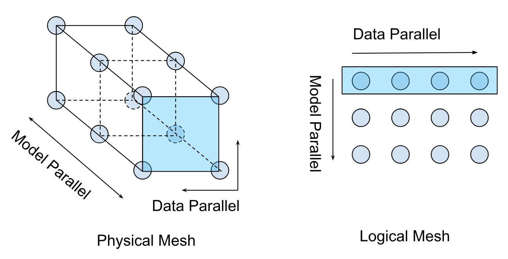

# PyTorch/XLA SPMD User Guide

In this user guide, we discuss how [GSPMD](https://arxiv.org/abs/2105.04663) is integrated in PyTorch/XLA, and provide a design overview to illustrate how the SPMD sharding annotation API and its constructs work. And then, we provide a list of reference examples for users to try.

## What is PyTorch/XLA SPMD?

[GSPMD](https://arxiv.org/abs/2105.04663) is an automatic parallelization system for common ML workloads. The XLA compiler will transform the single device program into a partitioned one with proper collectives, based on the user provided sharding hints. This feature allows developers to write PyTorch programs as if they are on a single large device without any custom sharded computation ops and/or collective communications to scale.

_Figure 1. Comparison of two different execution strategies, (a) for non-SPMD and (b) for SPMD._

To support GSPMD in PyTorch/XLA, we are introducing a new execution mode. Before GSPMD, the execution mode in PyTorch/XLA assumed multiple model replicas, each with a single core (Figure 1.a). This mode of execution, as illustrated in the above  suits data parallelism frameworks, like the popular PyTorch [Distributed Data Parallel (DDP)](https://pytorch.org/tutorials/intermediate/ddp_tutorial.html) or Fully Sharded Data Parallel (FSDP), but is also limited in that a replica can only reside on one device core for execution. PyTorch/XLA SPMD introduces a new execution mode that assumes a single replica with multiple cores (Figure 1.b), allowing a replica to run across multiple device cores. This shift unlocks more advanced parallelism strategies for better large model training performance.

PyTorch/XLA SPMD is available on the new [PJRT](https://github.com/pytorch/xla/blob/master/docs/pjrt.md) runtime. To enable PyTorch/XLA SPMD execution mode, the user must call <code>[use_spmd() API](https://github.com/pytorch/xla/blob/b8b484515a97f74e013dcf38125c44d53a41f011/torch_xla/runtime.py#L214)</code>.

It is important to note that SPMD is a replacement for any existing parallel mechanisms, including DDP and FSDP. Users can not mix two different execution modes (SPMD and non-SPMD), and later in this guide we will go over how to use SPMD annotation to perform DDP and FSDP.

Also, this version of the SPMD is currently only tested.optimized on Google Cloud TPU. GPU support and optimization will come in the 2.2 release.

## PyTorch/XLA SPMD Design Overview

### Simple Eexample & Sharding Aannotation API

Users can annotate native PyTorch tensors using the `mark_sharding` API ([src](https://github.com/pytorch/xla/blob/9a5fdf3920c18275cf7dba785193636f1b39ced9/torch_xla/experimental/xla_sharding.py#L388)). This takes `torch.Tensor` as input and returns a `XLAShardedTensor` as output.

Invoking `mark_sharding` API takes a user defined logical [mesh](#mesh) and [partition\_spec](#partition-spec) and generates a sharding annotation for the XLA compiler. The sharding spec is attached to the XLATensor. Here is a simple usage example from the [[RFC](https://github.com/pytorch/xla/issues/3871), to illustrate how the sharding annotation API works:

We can annotate different tensors in the PyTorch program to enable different parallelism techniques, as described in the comment below:

More complete unit test cases and integration test examples are available in the PyTorch/XLA [repo](https://github.com/pytorch/xla/tree/r2.0/test/spmd).

### Mesh

For a given cluster of devices, a physical mesh is a representation of the interconnect topology.

We derive a logical mesh based on this topology to create sub-groups of devices which can be used for partitioning different axes of tensors in a model.

We abstract logical mesh with [Mesh API](https://github.com/pytorch/xla/blob/028df4da388468fa9a41b1f98ea08bfce13b4c63/torch_xla/experimental/xla_sharding.py#L16). The axes of the logical Mesh can be named. Here is an example:

### Hybrid Mesh

Mesh nicely abstracts how the physical device mesh is constructed. Users can arrange devices in any shape and order using the logical mesh. However, one can define a more performant mesh based on the physical topology, especially when it involves Data Center Network (DCN) cross slice connections. HybridMesh creates a mesh which gives good performance out of the box for such multislice environments. It accepts ici\_mesh\_shape and dcn\_mesh\_shape which denote logical mesh shapes of inner and outer network.

### Partition Spec

partition\_spec has the same rank as the input tensor. Each dimension describes how the corresponding input tensor dimension is sharded across the device mesh (logically defined by mesh\_shape). `partition_spec` is a tuple of `device_mesh` dimension `index` or None. The index can be an `int` or `str`, if the corresponding mesh dimension is named. This specifies how each input rank is sharded (`index` to `mesh_shape`) or replicated (`None`).

We support all three types of sharding, described in the original [GSPMD](https://arxiv.org/abs/2105.04663) paper. For instance, one can specify partial replication like this:

### XLAShardedTensor

The main use case for `XLAShardedTensor` [[RFC](https://github.com/pytorch/xla/issues/3871)] is to annotate a native `torch.tensor` (on a single device) with a sharding spec. The annotation takes place immediately, but the actual sharding of the tensor is delayed as the computation is carried out lazily, except for the input tensors which are sharded without delay. Once a tensor is annotated and wrapped inside a `XLAShardedTensor`, it can be passed to existing PyTorch ops and `nn.Module` layers as `torch.Tensor`. This is important to ensure that the same PyTorch layers and tensor ops can be stacked together with `XLAShardedTensor`. This means that the user does not need to rewrite the existing ops and model codes for sharded computation. Namely, `XLAShardedTensor` will satisfy the following requirements:

*   `XLAShardedTensor` is a `torch.Tensor` subclass and works directly with native torch ops and `module.layers`. We use `__torch_dispatch__` to send `XLAShardedTensor` to the XLA backend. PyTorch/XLA retrieves attached sharding annotations to trace the graph and invokes XLA SPMDPartitioner.
*   Internally, `XLAShardedTensor` (and its global\_tensor input) is backed by `XLATensor` with a special data structure holding references to the sharded device data.
*   The sharded tensor after lazy execution may be gathered and materialized back to the host as global\_tensor when requested on the host (e.g., printing the value of the global tensor.
*   The handles to the local shards are materialized strictly after the lazy execution. `XLAShardedTensor` exposes [local\_shards](https://github.com/pytorch/xla/blob/909f28fa4c1a44efcd21051557b3bcf2d399620d/torch_xla/experimental/xla_sharded_tensor.py#L111) to return the local shards on addressable devices as <code>List[[XLAShard](https://github.com/pytorch/xla/blob/909f28fa4c1a44efcd21051557b3bcf2d399620d/torch_xla/experimental/xla_sharded_tensor.py#L12)]</code>.

There is also an ongoing effort to integrate <code>XLAShardedTensor</code> into <code>DistributedTensor</code> API to support XLA backend [[RFC](https://github.com/pytorch/pytorch/issues/92909)].

### Sharding-Aware Host-to-Device Data Loading

PyTorch/XLA SPMD takes a single-device program, shards and executes it in parallel. The SPMD execution requires using the native PyTorch DataLoader, which transfers data synchronously from the host to XLA devices. This blocks the training during the input data transfer every step. To improve the native data loading performance, we made PyTorch/XLA ParallelLoader support input sharding directly (src), when passed the optional kwarg _input\_sharding_:

### Distributed Checkpointing

PyTorch/XLA SPMD is compatible with the [torch.distributed.checkpoint](https://pytorch.org/docs/stable/distributed.checkpoint.html) library through a dedicated `Planner` instance. Users are able to synchronously save and load checkpoints through this common interface.

The SPMDSavePlanner and SPMDLoadPlanner ([src](https://github.com/pytorch/xla/blob/master/torch_xla/experimental/distributed_checkpoint.py)) classes enable the `save_state_dict` and `load_state_dict` functions to operate directly on the shards of an `XLAShardedTensor`, enabling all of the benefits of distributed checkpointing in SPMD training.

Here is a demonstration of the synchronous distributed checkpointing API:

### Virtual Device Optimization

PyTorch/XLA normally transfers tensor data asynchronously from host to device once the tensor is defined. This is to overlap the data transfer with the graph tracing time. However, because GSPMD allows the user to modify the tensor sharding _after _the tensor has been defined, we need an optimization to prevent unnecessary transfer of tensor data back and forth between host and device. We introduce Virtual Device Optimization, a technique to place the tensor data on a virtual device SPMD:0 first, before uploading to the physical devices when all the sharding decisions are finalized. Every tensor data in SPMD mode is placed on a virtual device, SPMD:0. The virtual device is exposed to the user as an XLA device XLA:0 with the actual shards on physical devices, like TPU:0, TPU:1, etc.

### Number of processes

Unlike existing DDP and FSDP, under the SPMD mode, there is always a single process running on each accelerator host. This provides the benefit that PyTorch/XLA only need to compile each graph once which can be reused for all accelerators attached to this host.

### Running SPMD on TPU Pod

There is no code change required to go from single TPU host to TPU Pod if you construct your mesh and partition spec based on the number of devices instead of some hardcode constant. To run the PyTorch/XLA workload on TPU Pod, please refer to the [Pods section](https://github.com/pytorch/xla/blob/master/docs/pjrt.md#pods) of our PJRT guide.

## Reference Examples

### Use SPMD to express Data Parallel

The SPMD API is general enough to express both data parallelism and model parallelism.  One can implement data parallelism simply by annotating the input batch dimension for sharding. Here, we have shard the batch dimension across all available devices (N-way):There are 2 ways of using SPMD to express data parallel or batch sharding:

PyTorch/XLA’s MpDeviceLoader supports input batch sharding, which also loads the batches to the devices in the background:

We highly recommend the second approach as it should yield a better training performance.

### Use SPMD to express FSDP(Fully Sharded Data Parallel)

PyTorch’s FSDP is data parallel + sharded model parameters at 0th dimension. Users first need to use SPMD to express Data Parallels as suggested in the previous section.

### Running Resnet50 example with SPMD

We provided a quick example of [resnet50](https://github.com/pytorch/xla/blob/master/test/spmd/test_train_spmd_imagenet.py) with a couple different SPMD sharding strategies for you to play around with. You can first run it without SPMD using

and check the throughput. After that you can enable the batch sharding with

Note that I used a batch size 4 times as large since I am running it on a TPU v4 which has 4 TPU devices attached to it. You should see the throughput becomes roughly 4x the non-spmd run.
