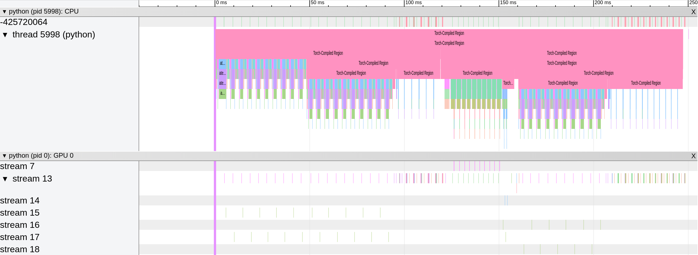

# Torchbench and PyTorch/XLA

[Torchbench][1] is a collection of open-source benchmarks used for evaluating PyTorch
performance.

PyTorch has [its own set of scripts][2] for running these benchmarks. They are used on
PyTorch's CI as well as their own [compiler's HUD web-page][3], which frequently checks
the performance of PyTorch dynamo (`torch.compile`) backends, such as inductor, inductor
with CUDAGraphs, etc.

In that sense, PyTorch/XLA also has its own set of benchmarking scripts that are used for
evaluating PyTorch/XLA performance, and compare it with the performance of PyTorch. The
scripts attempt to replicate the numbers in the PyTorch HUD, aiming towards a fair
comparison against PyTorch's main backend: inductor.

## Prerequisites

Make sure you have installed all of:

- [PyTorch][5]
- [PyTorch/XLA][6]
- [Torchbench][1]

Note that PyTorch/XLA follows [PyTorch's pin][7] for Torchbench. So, your mileage may vary
on other Torchbench versions. In order to make sure everything works as expected, we
recommend matching PyTorch and PyTorch/XLA by their commit date. Then, using whatever is
the Torchbench pin for that PyTorch version.

For the rest of this document, assume the following directory hierarchy:

```
- pytorch (current directory)
    |- ...
    |- xla (PyTorch/XLA root directory)
```

## Getting Started

The main entry-point for executing Torchbench with PyTorch/XLA benchmarking scripts is:
[_experiment_runner.py_][4]. See below the simplest command for running Torchbench.


```bash
python xla/benchmarks/experiment_runner.py \
    --suite-name=torchbench \
    --accelerator=cuda
```

It will run the whole Torchbench collection, with all possible configurations, repeating
10 times a 1-iteration run. For example, assume that Torchbench is composed of only 2
benchmarks (currently, there are 103): `llama` and `dlrm`. Then, the command will run 16
times (8 for each benchmark):

```
model: llama
 1. xla: None, dynamo: None,     test: eval
 2. xla: None, dynamo: None,     test: train
 3. xla: None, dynamo: inductor, test: eval
 4. xla: None, dynamo: inductor, test: train
 5. xla: PJRT, dynamo: None,     test: eval
 6. xla: PJRT, dynamo: None,     test: train
 7. xla: PJRT, dynamo: openxla,  test: eval
 8. xla: PJRT, dynamo: openxla,  test: train

model: dlrm
 9. xla: None, dynamo: None,     test: eval
10. xla: None, dynamo: None,     test: train
11. xla: None, dynamo: inductor, test: eval
12. xla: None, dynamo: inductor, test: train
13. xla: PJRT, dynamo: None,     test: eval
14. xla: PJRT, dynamo: None,     test: train
15. xla: PJRT, dynamo: openxla,  test: eval
16. xla: PJRT, dynamo: openxla,  test: train
```

Each of `xla:`, `dynamo:`, and `test:` are parameters to the _experiment_runner.py_ script
for filtering the desired experiment configurations. You can specify each of them as many
times as necessary, e.g. `--dynamo inductor --dynamo openxla`, filtering-out experiments
with configuration `dynamo: None`. Additionally, you can filter models by specifying the
`--filter` parameter as many times as you want. For example:

```bash
python xla/benchmarks/experiment_runner.py \
    --suite-name=torchbench \
    --accelerator=cuda \
    --xla=PJRT \
    --dynamo=openxla --dynamo=None \
    --test=eval \
    --filter=llama
```

It will run only `llama` inference (`--test=eval`) using PJRT with and without dynamo. Or,
more verbosely:

```
model: llama
1. xla: PJRT, dynamo: None,     test: eval
2. xla: PJRT, dynamo: openxla,  test: eval
```

You can also modify the number of repetitions (`--repeat`) as well as the number of
iterations (`--iterations-per-run`) to be run in each repetition. For a more detailed list
of the available command-line arguments, run _experiment_runner.py_ with the `--help`
argument:

```bash
python xla/benchmarks/experiment_runner.py --help
```

Finally, the benchmarking script will output the file _output/results.jsonl_, where each
line will contain: (i) the experiment information, e.g. model name, xla, dynamo, test,
etc.; and (ii) collected metrics, e.g. total running time, etc. A line in that file will
look like the following:

```
{
  "model": {
    "suite_name": "torchbench",
    "model_name": "llama"
  },
  "experiment": {
    "accelerator": "cuda",
    "accelerator_model": "NVIDIA ...",
    "xla": "PJRT",
    "xla_flags": null,
    "dynamo": "openxla",
    "torch_xla2": null,
    "keep_model_data_on_cuda": false,
    "test": "eval",
    "batch_size": 1
  },
  "repeat": 5,
  "iterations_per_run": 1,
  "metrics": {
    "total_time": [...],
    ...
  },
  "timestamp": ...,
  "verification_code": "VERIFIER_SKIPPED"
}
```

## Troubleshooting and Debugging

### Run the Verifier

First things of, make sure that the benchmark you are trying to run actually meets [the
accuracy we expect](#model-verification) by passing the `--verify` flag to the
_experiment_runner.py_ script. If the benchmark does passes the check, you should see the
following in your _results.jsonl_ file:

```
{
  "model": {
    "suite_name": "torchbench",
    "model_name": "llama"
  },
  ...
  "verification_code": "PASS"
}
```

With this result in hands, if the `verification_code` is something other than `PASS` it
means either that the result (prediction/gradients) is wrong, or that we cannot tell, for
some reason. More specifically:

| Flag                         | Troubleshoot                                                  |
|:----------------------------:|---------------------------------------------------------------|
| `FAIL`                       | Result is wrong                                               |
| `EAGER_FAILED`               | This benchmark should not be running (it is failing on eager) |
| `EXCEPTION_RAISED`           | There may be something wrong with the verifier                |
| `NONDETERMINISTIC_EAGER_RUN` | Eager is not deterministic, so cannot compare the results     |
| `VERIFIER_SKIPPED`           | We should skip the verifier for this benchmark                |
| `VERIFIER_DIDNT_RUN`         | There was some uncaught error with the verifier process       |

Please, open an issue if you see any of the codes in the table above, except for
`FAIL`. If you see `FAIL`, but did not introduce any change to any code, please, open an
issue. Otherwise, it means that your change likely introduced some incorrect behavior.

### Profile the Benchmark

In order to find out performance improvement opportunities, the benchmarking scripts
provide a few command-line arguments. For more information, check out [the optional
metrics](#optional-metrics) and [the available dump-able
information](#dumping-benchmark-specific-data).

A good overall command-line argument for that is the flag `--dump-pytorch-profiles` (see
[this section](#dumping-benchmark-specific-data) for more details). It makes use of
[PyTorch baked in profiler][11].

Suppose, for example we profile [the `speech_transformer` benchmark][12] by passing that
flag to _experiment_runner.py_ script. We would end up with the following directory
hierarchy:

```
- output
    |- results.jsonl
    |- speech_transformer
        |- 0
            |- pytorch-profile-...-speech_transformer.txt
            |- trace-...-speech_transformer.json
        |- 1
            |- pytorch-profile-...-speech_transformer.txt
            |- trace-...-speech_transformer.json
        |- 2
            |- pytorch-profile-...-speech_transformer.txt
            |- trace-...-speech_transformer.json
        ...
        |- pytorch-profile-...-speech_transformer.txt
```

- **Numbered Directories:** represents each repetition

- **Repetition-Specific _pytorch-profile-...txt_:** a table with the time spent in each
  operation inside PyTorch

```
-------------------------------------------------------  ------------  ------------  ------------  ------------  ------------  ------------  ------------  ------------  ------------  ------------  
                                                   Name    Self CPU %      Self CPU   CPU total %     CPU total  CPU time avg     Self CUDA   Self CUDA %    CUDA total  CUDA time avg    # of Calls  
-------------------------------------------------------  ------------  ------------  ------------  ------------  ------------  ------------  ------------  ------------  ------------  ------------  
                                    loop_convert_fusion         0.00%       0.000us         0.00%       0.000us       0.000us       1.037ms        27.24%       1.037ms      26.581us            39  
ampere_bf16_s1688gemm_bf16_128x128_ldg8_f2f_stages_3...         0.00%       0.000us         0.00%       0.000us       0.000us     603.560us        15.86%     603.560us      33.531us            18  
         ampere_bf16_s1688gemm_bf16_128x128_ldg8_f2f_tn         0.00%       0.000us         0.00%       0.000us       0.000us     407.618us        10.71%     407.618us      16.305us            25  
ampere_bf16_s16816gemm_bf16_128x128_ldg8_f2f_stages_...         0.00%       0.000us         0.00%       0.000us       0.000us     324.994us         8.54%     324.994us      54.166us             6  
                                  Torch-Compiled Region        29.63%      74.028ms       498.57%        1.246s      83.052ms       0.000us         0.00%     206.090us      13.739us            15  
void cutlass::Kernel<cutlass_80_wmma_tensorop_bf16_s...         0.00%       0.000us         0.00%       0.000us       0.000us     143.426us         3.77%     143.426us      11.952us            12  
void cutlass::Kernel<cutlass_80_wmma_tensorop_bf16_s...         0.00%       0.000us         0.00%       0.000us       0.000us     135.970us         3.57%     135.970us       5.665us            24  
...
                                         aten::_to_copy         0.56%       1.400ms         0.62%       1.537ms     384.260us       0.000us         0.00%       0.000us       0.000us             4  
-------------------------------------------------------  ------------  ------------  ------------  ------------  ------------  ------------  ------------  ------------  ------------  ------------  
Self CPU time total: 249.871ms
Self CUDA time total: 3.806ms
```

- **Repetition-Specific _trace-...json_:** a JSON file, containing the time-line of the
  profiled events, to be loaded in a chrome browser at address `chrome://tracing` (see
  [this page][13] for more details)



- **Outer _pytorch-profile-...txt_:** the concatenation of the tables corresponding to
  each repetition

### Tweaking a Benchmark

In general, the benchmarking scripts were written so as to reproduce PyTorch HUD inductor
results while comparing with PyTorch/XLA performance. Therefore, much of the execution
setup was mirrored from [PyTorch HUD benchmarking scripts][2]. That said, we do allow a
couple of customization room by exposing a few command-line arguments:

- `--batch-size`: it is benchmark-specific (from PyTorch Torchbench configuration file),
  by default

- [`--matmul-precision`][14]: it is set to `high`, by default

### Intermediate Representations (IRs)

PyTorch/XLA manipulates mainly 2 IRs:

1. **PyTorch lazy IR:** directed acyclic graph (DAG) created by the tracing phase; and
2. **HLO Graph:** DAG output of lowering the lazy IR, [used by XLA][15] in the backend

In order to inspect them (i.e. the compiled HLO graphs), our benchmarking scripts exposed
[the `--save-ir-format` command-line argument](#dumping-benchmark-specific-data). By
specifying such a flag, every compiled graph will get dumped in the file
_dump-...<format>_, where _"<format>"_ can be any of:

- `text` (for lazy IR)

```
IR {
  %0 = bf16[] xla::device_data(), xla_shape=bf16[]
  %1 = bf16[1,27,84,84]{3,2,1,0} xla::device_data(), xla_shape=bf16[1,27,84,84]{3,2,1,0}
  %2 = bf16[1,27,84,84]{3,2,1,0} aten::div(%1, %0), xla_shape=bf16[1,27,84,84]{3,2,1,0}, ROOT=0
  %3 = bf16[32]{0} xla::device_data(), xla_shape=bf16[32]{0}
  %4 = bf16[32,27,3,3]{3,2,1,0} xla::device_data(), xla_shape=bf16[32,27,3,3]{3,2,1,0}
  %5 = bf16[1,32,41,41]{3,2,1,0} aten::convolution_overrideable(%2, %4, %3), xla_shape=bf16[1,32,41,41]{3,2,1,0}
  %6 = bf16[1,32,41,41]{3,2,1,0} aten::relu(%5), xla_shape=bf16[1,32,41,41]{3,2,1,0}, ROOT=1
  %7 = bf16[32]{0} xla::device_data(), xla_shape=bf16[32]{0}
  %8 = bf16[32,32,3,3]{3,2,1,0} xla::device_data(), xla_shape=bf16[32,32,3,3]{3,2,1,0}
  %9 = bf16[1,32,39,39]{3,2,1,0} aten::convolution_overrideable(%6, %8, %7), xla_shape=bf16[1,32,39,39]{3,2,1,0}
  ...
  %66 = bf16[1,1]{1,0} aten::exp(%65), xla_shape=bf16[1,1]{1,0}, ROOT=7
}
```

- `hlo` (for HLO IR)

```
HloModule IrToHlo.129, entry_computation_layout={(bf16[], bf16[1,27,84,84]{3,2,1,0}, bf16[32]{0}, bf16[32,27,3,3]{3,2,1,0}, bf16[32]{0}, /*index=5*/bf16[32,32,3,3]{3,2,1,0}, bf16[32]{0}, bf16[32,32,3,3]{3,2,1,0}, bf16[32]{0}, bf16[32,32,3,3]{3,2,1,0}, /*index=10*/bf16[50]{0}, bf16[50]{0}, bf16[50,39200]{1,0}, bf16[50]{0}, bf16[2]{0}, /*index=15*/bf16[2,1024]{1,0}, bf16[1024]{0}, bf16[1024,1024]{1,0}, bf16[1024]{0}, bf16[1024,50]{1,0}, /*index=20*/bf16[], f32[])->(bf16[1,27,84,84]{3,2,1,0}, bf16[1,32,41,41]{3,2,1,0}, bf16[1,32,39,39]{3,2,1,0}, bf16[1,32,37,37]{3,2,1,0}, bf16[1,32,35,35]{3,2,1,0}, /*index=5*/bf16[1,50]{1,0}, bf16[1,1]{1,0}, bf16[1,1]{1,0})}

ENTRY %IrToHlo.129 (p0.1: bf16[], p1.2: bf16[1,27,84,84], p2.5: bf16[32], p3.6: bf16[32,27,3,3], p4.14: bf16[32], p5.15: bf16[32,32,3,3], p6.23: bf16[32], p7.24: bf16[32,32,3,3], p8.32: bf16[32], p9.33: bf16[32,32,3,3], p10.42: bf16[50], p11.55: bf16[50], p12.56: bf16[50,39200], p13.73: bf16[50], p14.82: bf16[2], p15.83: bf16[2,1024], p16.85: bf16[1024], p17.86: bf16[1024,1024], p18.88: bf16[1024], p19.89: bf16[1024,50], p20.112: bf16[], p21.113: f32[]) -> (bf16[1,27,84,84], bf16[1,32,41,41], bf16[1,32,39,39], bf16[1,32,37,37], bf16[1,32,35,35], /*index=5*/bf16[1,50], bf16[1,1], bf16[1,1]) {
  %constant.43 = bf16[] constant(0)
  %reshape.44 = bf16[1]{0} reshape(bf16[] %constant.43)
  %broadcast.45 = bf16[1]{0} broadcast(bf16[1]{0} %reshape.44), dimensions={0}
  %constant.46 = bf16[] constant(0)
  %reshape.47 = bf16[1]{0} reshape(bf16[] %constant.46)
  %broadcast.48 = bf16[1]{0} broadcast(bf16[1]{0} %reshape.47), dimensions={0}
  %p1.2 = bf16[1,27,84,84]{3,2,1,0} parameter(1)
  %p0.1 = bf16[] parameter(0)
  %broadcast.3 = bf16[1,27,84,84]{3,2,1,0} broadcast(bf16[] %p0.1), dimensions={}
  %divide.4 = bf16[1,27,84,84]{3,2,1,0} divide(bf16[1,27,84,84]{3,2,1,0} %p1.2, bf16[1,27,84,84]{3,2,1,0} %broadcast.3)
  %p3.6 = bf16[32,27,3,3]{3,2,1,0} parameter(3)
  %convolution.7 = bf16[1,32,41,41]{3,2,1,0} convolution(bf16[1,27,84,84]{3,2,1,0} %divide.4, bf16[32,27,3,3]{3,2,1,0} %p3.6), window={size=3x3 stride=2x2}, dim_labels=bf01_oi01->bf01, operand_precision={high,high}
  %p2.5 = bf16[32]{0} parameter(2)
  %broadcast.8 = bf16[1,41,41,32]{3,2,1,0} broadcast(bf16[32]{0} %p2.5), dimensions={3}
  %transpose.9 = bf16[1,32,41,41]{1,3,2,0} transpose(bf16[1,41,41,32]{3,2,1,0} %broadcast.8), dimensions={0,3,1,2}
  %add.10 = bf16[1,32,41,41]{3,2,1,0} add(bf16[1,32,41,41]{3,2,1,0} %convolution.7, bf16[1,32,41,41]{1,3,2,0} %transpose.9)
  ...
  ROOT %tuple.128 = (bf16[1,27,84,84]{3,2,1,0}, bf16[1,32,41,41]{3,2,1,0}, bf16[1,32,39,39]{3,2,1,0}, bf16[1,32,37,37]{3,2,1,0}, bf16[1,32,35,35]{3,2,1,0}, /*index=5*/bf16[1,50]{1,0}, bf16[1,1]{1,0}, bf16[1,1]{1,0}) tuple(bf16[1,27,84,84]{3,2,1,0} %divide.4, bf16[1,32,41,41]{3,2,1,0} %maximum.13, bf16[1,32,39,39]{3,2,1,0} %maximum.22, bf16[1,32,37,37]{3,2,1,0} %maximum.31, bf16[1,32,35,35]{3,2,1,0} %maximum.40, /*index=5*/bf16[1,50]{1,0} %tanh.81, bf16[1,1]{1,0} %slice.109, bf16[1,1]{1,0} %exponential.127)
}
```

- `stablehlo` (for StableHLO IR)

```
module @IrToHlo.129 attributes {mhlo.cross_program_prefetches = [], mhlo.input_output_alias = [], mhlo.is_dynamic = false, mhlo.use_auto_spmd_partitioning = false} {
  func.func @main(%arg0: tensor<bf16>, %arg1: tensor<1x27x84x84xbf16>, %arg2: tensor<32xbf16>, %arg3: tensor<32x27x3x3xbf16>, %arg4: tensor<32xbf16>, %arg5: tensor<32x32x3x3xbf16>, %arg6: tensor<32xbf16>, %arg7: tensor<32x32x3x3xbf16>, %arg8: tensor<32xbf16>, %arg9: tensor<32x32x3x3xbf16>, %arg10: tensor<50xbf16>, %arg11: tensor<50xbf16>, %arg12: tensor<50x39200xbf16>, %arg13: tensor<50xbf16>, %arg14: tensor<2xbf16>, %arg15: tensor<2x1024xbf16>, %arg16: tensor<1024xbf16>, %arg17: tensor<1024x1024xbf16>, %arg18: tensor<1024xbf16>, %arg19: tensor<1024x50xbf16>, %arg20: tensor<bf16>, %arg21: tensor<f32>) -> (tensor<1x27x84x84xbf16>, tensor<1x32x41x41xbf16>, tensor<1x32x39x39xbf16>, tensor<1x32x37x37xbf16>, tensor<1x32x35x35xbf16>, tensor<1x50xbf16>, tensor<1x1xbf16>, tensor<1x1xbf16>) {
    %cst = stablehlo.constant dense<1.000000e+00> : tensor<1x1xbf16>
    %cst_0 = stablehlo.constant dense<0.000000e+00> : tensor<1x1024xbf16>
    %cst_1 = stablehlo.constant dense<0.000000e+00> : tensor<1xbf16>
    %cst_2 = stablehlo.constant dense<1.000000e+00> : tensor<1xbf16>
    %cst_3 = stablehlo.constant dense<0.000000e+00> : tensor<1x32x35x35xbf16>
    %cst_4 = stablehlo.constant dense<0.000000e+00> : tensor<1x32x37x37xbf16>
    %cst_5 = stablehlo.constant dense<0.000000e+00> : tensor<1x32x39x39xbf16>
    %cst_6 = stablehlo.constant dense<0.000000e+00> : tensor<1x32x41x41xbf16>
    %0 = stablehlo.broadcast_in_dim %arg0, dims = [] : (tensor<bf16>) -> tensor<1x27x84x84xbf16>
    %1 = stablehlo.divide %arg1, %0 : tensor<1x27x84x84xbf16>
    %2 = stablehlo.convolution(%1, %arg3) dim_numbers = [b, f, 0, 1]x[o, i, 0, 1]->[b, f, 0, 1], window = {stride = [2, 2], pad = [[0, 0], [0, 0]], lhs_dilate = [1, 1], rhs_dilate = [1, 1], reverse = [false, false]} {batch_group_count = 1 : i64, feature_group_count = 1 : i64, precision_config = [#stablehlo<precision HIGH>, #stablehlo<precision HIGH>]} : (tensor<1x27x84x84xbf16>, tensor<32x27x3x3xbf16>) -> tensor<1x32x41x41xbf16>
    %3 = stablehlo.broadcast_in_dim %arg2, dims = [1] : (tensor<32xbf16>) -> tensor<1x32x41x41xbf16>
    %4 = stablehlo.add %2, %3 : tensor<1x32x41x41xbf16>
    %5 = stablehlo.maximum %4, %cst_6 : tensor<1x32x41x41xbf16>
    %6 = stablehlo.convolution(%5, %arg5) dim_numbers = [b, f, 0, 1]x[o, i, 0, 1]->[b, f, 0, 1], window = {stride = [1, 1], pad = [[0, 0], [0, 0]], lhs_dilate = [1, 1], rhs_dilate = [1, 1], reverse = [false, false]} {batch_group_count = 1 : i64, feature_group_count = 1 : i64, precision_config = [#stablehlo<precision HIGH>, #stablehlo<precision HIGH>]} : (tensor<1x32x41x41xbf16>, tensor<32x32x3x3xbf16>) -> tensor<1x32x39x39xbf16>
    %7 = stablehlo.broadcast_in_dim %arg4, dims = [1] : (tensor<32xbf16>) -> tensor<1x32x39x39xbf16>
    %8 = stablehlo.add %6, %7 : tensor<1x32x39x39xbf16>
    %9 = stablehlo.maximum %8, %cst_5 : tensor<1x32x39x39xbf16>
    %10 = stablehlo.convolution(%9, %arg7) dim_numbers = [b, f, 0, 1]x[o, i, 0, 1]->[b, f, 0, 1], window = {stride = [1, 1], pad = [[0, 0], [0, 0]], lhs_dilate = [1, 1], rhs_dilate = [1, 1], reverse = [false, false]} {batch_group_count = 1 : i64, feature_group_count = 1 : i64, precision_config = [#stablehlo<precision HIGH>, #stablehlo<precision HIGH>]} : (tensor<1x32x39x39xbf16>, tensor<32x32x3x3xbf16>) -> tensor<1x32x37x37xbf16>
    ...
    return %1, %5, %9, %13, %17, %29, %44, %54 : tensor<1x27x84x84xbf16>, tensor<1x32x41x41xbf16>, tensor<1x32x39x39xbf16>, tensor<1x32x37x37xbf16>, tensor<1x32x35x35xbf16>, tensor<1x50xbf16>, tensor<1x1xbf16>, tensor<1x1xbf16>
  }
}
```

### Torchbench Configuration

In order to get as close as possible to the Torchbench configuration used in the PyTorch
HUD, our benchmarking scripts make use of the YAML file [found in the PyTorch core
repository][16] (e.g. `dtypes`, batch-size, tolerance, benchmarks to be skipped), which we
shall refer to it as if it were a dictionary `config`. In summary, here are some implicit
configurations that may not be obvious at first:

- **Inference `dtype`:** always set to `bfloat16` unless the model is found in
  `config["dtype"]["force_amp_for_fp16_bf16_models"]` (the model is run in AMP mode)
  and `config["dtype"]["force_fp16_for_bf16_models"]` (the model is run using `float16`)

- **Training `dtype`:** always set to use AMP mode

- **Inductor:** CUDAGraphs always on

- **Model Initialization:** some benchmarks change their behavior depending on the
  device. Therefore, when using XLA:CUDA, we first initialize the benchmark on CUDA, and
  then move it to XLA:CUDA

## Experiment Results

The benchmarking scripts will store the resulting artifacts in a directory called `output`
(default) or another one specified by the parameter `--output-dirname`.

### Experiments and Metrics

When running _experiment_runner.py_ script, a [JSONL][8] file called _results.jsonl_ will
be created (if it doesn't already exists), where each JSON line corresponds to an
experiment instance. Each line contains: (i) experiment information; and (ii) collected
metrics.

#### Collected Metrics

By default, the benchmarking scripts will collect a 2 metrics:

1. `total_time`: time taken for running all iterations
2. `per_iter_time`: average iteration time

If the experiment runner actually uses one of PyTorch/XLA backends, the scripts will
additionally collect 6 new metrics:

1. `trace_total_time`: sum of the tracing time for all iterations
2. `trace_per_iter_time`: average tracing time
3. `xla_CompileTime_time_s`: sum of the compilation time for all generated graphs
4. `xla_CompileTime_number`: number of graphs compiled
5. `xla_ExecutionTime_time_s`: sum of the execution time for all compiled graphs
6. `xla_ExecutionTime_number`: number of times that a compiled graph was executed

#### Optional Metrics

**Dynamo Counters:** the flag `--collect-dynamo-counters` appends the PyTorch dynamo
counters to the metrics information. For example, number of successfully traced frames,
number of FX graphs compiled successfully by AOTAutograd, inductor related information,
etc.

**Profiler Metrics for CPU and CUDA:** the flag `--profile-cuda-cpu` collects CPU and CUDA
profiling information about the execution. Specifically, it collects 4 of them:

1. `total_cpu_time_s`: total CPU time take for running all iterations
2. `per_iter_cpu_time_s`: average CPU time taken on each iteration
3. `total_cuda_time_s`: total CUDA time take for running all iterations
4. `per_iter_cuda_time_s`: average CPU time taken on each iteration

**Profiler Metrics for CPU and CUDA for unlowered operations:** the flag
`--profile-cuda-cpu-individual-ops` collects profiling information for operations that
went through the fallback path, i.e. those for which PyTorch/XLA does not have a
lowering. For each of those operations, the scripts collect 5 new metrics:

1. `self_cpu_time_s`: CPU time spent in that operation
2. `total_cpu_time_s`: CPU time spent running that function, including other dependent
   operations
3. `self_cuda_time_s`: CUDA time spent in that operation
4. `total_cuda_time_s`: CUDA time spent running that function, including other dependent
   operations
5. `num_of_calls`: number of times that operation was called

### Dumping Benchmark-specific Data

Besides the collected metrics, the benchmarking scripts have the option for dumping
information specific to each benchmark. These are stored in a newly created directory for
each benchmark, under the output directory. The descriptions below assume all paths are
relative to the benchmark-specific directory.

There is information that is collected for each repetition (controlled by `--repeat`
parameter) of a benchmark. Those are stored in separate directories, one for each
repetition. For better clarity, we shall refer to those flags by marking them with the
_"repeat-specific"_ tag.

**HLO Modules:** the flag `--dump-hlo` sets the environment variable `XLA_FLAGS`, dumping
XLA compiled HLO modules into the _"hlo"_ directory.

**Dynamo Counters:** (repeat-specific) the flag `--dump-dynamo-counters` is similar to the
already mentioned `--collect-dynamo-counters` flag. However, instead of collecting them
and storing in a JSON line inside _results.jsonl_, setting this flag will dump the dynamo
counter dictionary into a new file.

**PyTorch Profiles and Trace:** (repeat-specific) the flag `--dump-pytorch-profiles`
creates 2 new files. For more detailed information, check out [this post][9] explaining
PyTorch profiling:

1. Chrome trace: same as calling `profiler.export_chrome_trace`
2. Profile: same as calling `profiler.key_averages().table(...)`, a summarized table with
   the timing averages

**PyTorch/XLA Metrics:** (repeat-specific) the flag `--dump-pytorch-xla-metrics` creates a
new file, dumping PyTorch/XLA metrics, such as graph compiling and execution information.

**Intermediate Representations (IR):** the parameter `--save-ir` allows the selection of
one of the used IRs: `hlo` (similar to `--dump-hlo` above), `stablehlo`, and `text`
(PyTorch lazy IR).

## Model Verification

In order to validate the execution of the benchmarks, it is possible to run an accuracy
check on them by specifying the flag `--verify`. For consistency reasons, we run a similar
version of the accuracy test run in the PyTorch HUD, which, at its core, uses [the `same`
function][10]. In summary, it tries to check the accuracy of the inference
prediction/training gradients by running one of these three methods: (i) cosine
similarity; (ii) `torch.allclose`; and (iii) root mean squared error (RMSE).

As the result of the verification, the benchmarking scripts will change the
`verification_code` field of the corresponding line of the _results.jsonl_ file with one
of the following:

| Flag                         | Short Description                                        |
|:----------------------------:|----------------------------------------------------------|
| `PASS`                       | Verification passed the accuracy check                   |
| `FAIL`                       | Verification failed the accuracy check                   |
| `EAGER_FAILED`               | Eager execution failed                                   |
| `EXCEPTION_RAISED`           | An exception was raised when running the verifier        |
| `NONDETERMINISTIC_EAGER_RUN` | Two eager runs of the benchmark have mismatching results |
| `VERIFIER_SKIPPED`           | Verification was skipped                                 |
| `VERIFIER_DIDNT_RUN`         | Verification did not run due to an unexpected reason     |


[1]: https://github.com/pytorch/benchmark
[2]: https://github.com/pytorch/pytorch/blob/main/benchmarks/dynamo/torchbench.py
[3]: https://hud.pytorch.org/benchmark/compilers
[4]: https://github.com/pytorch/xla/blob/master/benchmarks/experiment_runner.py
[5]: https://github.com/pytorch/pytorch
[6]: https://github.com/pytorch/xla
[7]: https://github.com/pytorch/pytorch/blob/main/.github/ci_commit_pins/torchbench.txt
[8]: https://jsonlines.org/
[9]: https://pytorch.org/docs/stable/torch.compiler_profiling_torch_compile.html
[10]: https://github.com/pytorch/pytorch/blob/a4e9a1c90b74572b48f2eedf1e931c18713c1781/torch/_dynamo/utils.py#L1616
[11]: https://pytorch.org/tutorials/recipes/recipes/profiler_recipe.html
[12]: https://github.com/pytorch/benchmark/tree/main/torchbenchmark/models/speech_transformer
[13]: https://pytorch.org/tutorials/recipes/recipes/profiler_recipe.html#using-tracing-functionality
[14]: https://github.com/pytorch/pytorch/issues/76440
[15]: https://openxla.org/xla/architecture
[16]: https://github.com/pytorch/pytorch/blob/main/benchmarks/dynamo/torchbench.yaml
