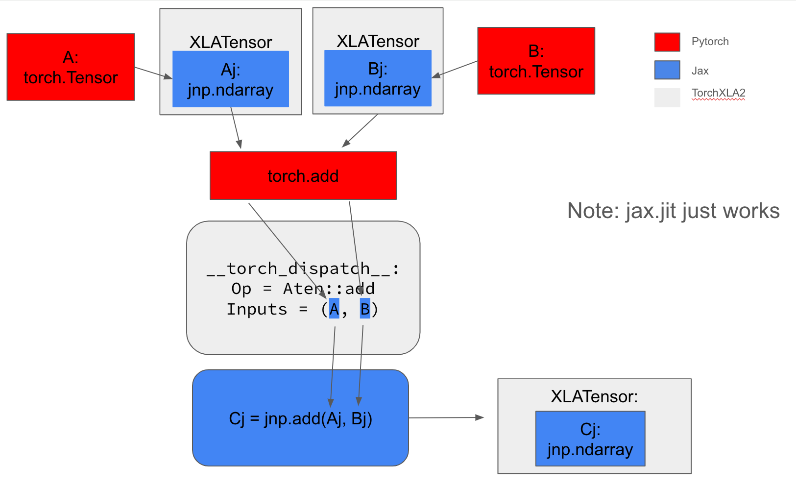

How it works
============


## Tensor subclass and eager mode

The class `Tensor` is a `torch.Tensor` subclass
that overrides `__torch_dispatch__`.

It roughly looks like this (with some details removed):

The complete class impl is at [tensor.py](../torchax/tensor.py).

```python
class Tensor(torch.Tensor):

  @staticmethod
  def __new__(cls, elem):
    return torch.Tensor._make_wrapper_subclass(
        cls,
        shape,
        dtype=dtype,
        device='meta',
        requires_grad=False,
    )

  def __init__(self, elem: jax.Array):
    super().__init__()
    self._elem = elem

  __torch_function__ = torch._C._disabled_torch_function_impl

  @classmethod
  def __torch_dispatch__(cls, func, types, args=(), kwargs=None):
    # here assumes ALL tensors in args / kwargs are
    # instances of Tensor
    args, kwargs = unwrap((args, kwargs))
    jax_func = some_registry[func]
    res = jax_func(*args, **kwargs)
    return wrap(res)

def wrap(tree):
    # wrap jax.Array with Tensor
    return pytree.tree_map_only(
        jax.Array, Tensor, tree)

def unwrap(tree):
    # get jax.Array out ofTensor
    return pytree.tree_map_only(
        Tensor, lambda x: x._elem, tree)
```

In other words, assuming that we have a function
that takes `jax.Array` as input and returns `jax.Array`
but otherwise implement the same semantics
as a `ATen` op; then, using this tensor we would
be able to route the call to this jax function.

[_ops.py](../torchax/_ops.py) files defines some of those ops.

Let's take `aten::add` as example:

```python
@op(torch.ops.aten.add)
def _aten_add(x, y, *, alpha=1):
  """if isinstance(x, jnp.ndarray) and isinstance(y, jnp.ndarray):

  assert x.dtype == y.dtype, (x.dtype, y.dtype)
  """
  return x + y * alpha
```

The `@op` decorator just puts this function into `some_registry` dictionary.

`_aten_add` has same signature as `torch.ops.aten.add` but takes `jax.Array` as
input.




## fx Interpreter and dynamo mode

Now, assuming we have this `some_registry` dict with key core Aten ops,
and value the equivalent python Jax functions. We can also build a `fx.Interpreter`
subclass that executes the jax function given a `fx.GraphModule`.


```python
class JaxInterpreter(torch.fx.Interpreter):

  def call_function(self, target, args: Tuple, kwargs: Dict) -> Any:
    if not isinstance(target,
                      (torch._ops.OpOverloadPacket, torch._ops.OpOverload)):
      return super().call_function(target, args, kwargs)

    op = some_registry[target]
    return op.func(*args, **kwargs)
```

There is no wrapping and unwrapping needed because `args` and `kwargs` are
already `jax.Array`'s.

Using this interpreter we can build a dynamo backend:

```python
def backend(fxgraph):

   def tojit(*args, *kwargs):
    return JaxInterpreter(fxgraph).run(*args, **kwargs)
   jitted = jax.jit(to_jit)

   def f(*torchtensor):
     jaxarrays = unwrap(torchtensors)
     res = jitted(jax_array)
     return wrap(res)

   return f
```

The inner function `tojit` is a function that takes and returns
`jax.Array`'s. So it's suitable to be jitted with `jax.jit`.

`f` is returned callable that takes `Tensor`; so can interop with
other torch codes.

## nn.Modules and state management

See [README.md](../README.md) for using `torch.func.functional_call` to
make `nn.Module`s interact well with `jax.jit`.

See [Examples](../examples/README.md) for training using torch's optimizers or jax's
optimizers.

[def]: dispatch.png
